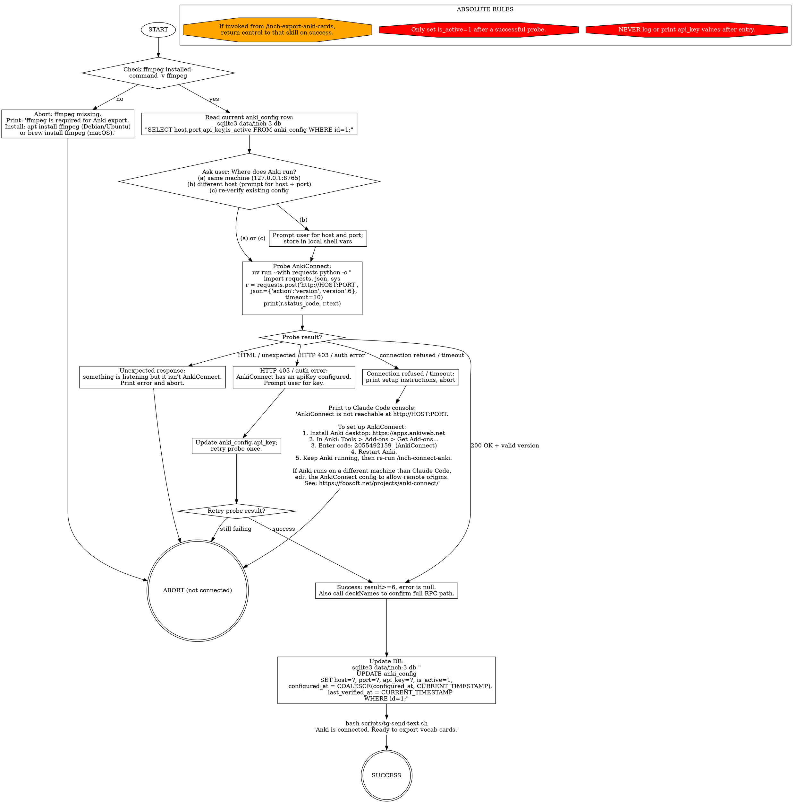

```dot
digraph inch_connect_anki {
    // Connect Anki
    // Sets up the AnkiConnect connection for Inch 3.
    // Reads/writes: anki_config (singleton).
    //
    // ARCHITECTURE: This skill runs as a Claude Code task. It probes the
    // AnkiConnect HTTP endpoint, stores host/port/api_key in anki_config,
    // and marks is_active=1 on success.
    // Python: inline `uv run --with requests python -c "..."` for the HTTP probe.
    // SQLite: direct `sqlite3 data/inch-3.db` commands.
    //
    // NEVER log or print api_key values after entry.

    "START" [shape=ellipse];
    "Check ffmpeg installed:\ncommand -v ffmpeg" [shape=diamond];
    "Abort: ffmpeg missing.\nPrint: 'ffmpeg is required for Anki export.\nInstall: apt install ffmpeg (Debian/Ubuntu)\nor brew install ffmpeg (macOS).'" [shape=box];
    "Read current anki_config row:\nsqlite3 data/inch-3.db\n\"SELECT host,port,api_key,is_active FROM anki_config WHERE id=1;\"" [shape=box];
    "Ask user: Where does Anki run?\n(a) same machine (127.0.0.1:8765)\n(b) different host (prompt for host + port)\n(c) re-verify existing config" [shape=diamond];
    "Prompt user for host and port;\nstore in local shell vars" [shape=box];
    "Probe AnkiConnect:\nuv run --with requests python -c \"\nimport requests, json, sys\nr = requests.post('http://HOST:PORT',\n  json={'action':'version','version':6},\n  timeout=10)\nprint(r.status_code, r.text)\n\"" [shape=box];
    "Probe result?" [shape=diamond];
    "Success: result>=6, error is null.\nAlso call deckNames to confirm full RPC path." [shape=box];
    "Update DB:\nsqlite3 data/inch-3.db \"\nUPDATE anki_config\nSET host=?, port=?, api_key=?, is_active=1,\n    configured_at = COALESCE(configured_at, CURRENT_TIMESTAMP),\n    last_verified_at = CURRENT_TIMESTAMP\nWHERE id=1;\"" [shape=box];
    "bash scripts/tg-send-text.sh\n'Anki is connected. Ready to export vocab cards.'" [shape=plaintext];
    "SUCCESS" [shape=doublecircle];

    "Connection refused / timeout:\nprint setup instructions, abort" [shape=box];
    "Print to Claude Code console:\n'AnkiConnect is not reachable at http://HOST:PORT.\n\nTo set up AnkiConnect:\n  1. Install Anki desktop: https://apps.ankiweb.net\n  2. In Anki: Tools > Add-ons > Get Add-ons...\n  3. Enter code: 2055492159  (AnkiConnect)\n  4. Restart Anki.\n  5. Keep Anki running, then re-run /inch-connect-anki.\n\nIf Anki runs on a different machine than Claude Code,\nedit the AnkiConnect config to allow remote origins.\nSee: https://foosoft.net/projects/anki-connect/'" [shape=plaintext];
    "ABORT (not connected)" [shape=doublecircle];

    "HTTP 403 / auth error:\nAnkiConnect has an apiKey configured.\nPrompt user for key." [shape=box];
    "Update anki_config.api_key;\nretry probe once." [shape=box];
    "Retry probe result?" [shape=diamond];

    "Unexpected response:\nsomething is listening but it isn't AnkiConnect.\nPrint error and abort." [shape=box];

    "START" -> "Check ffmpeg installed:\ncommand -v ffmpeg";
    "Check ffmpeg installed:\ncommand -v ffmpeg" -> "Abort: ffmpeg missing.\nPrint: 'ffmpeg is required for Anki export.\nInstall: apt install ffmpeg (Debian/Ubuntu)\nor brew install ffmpeg (macOS).'" [label="no"];
    "Abort: ffmpeg missing.\nPrint: 'ffmpeg is required for Anki export.\nInstall: apt install ffmpeg (Debian/Ubuntu)\nor brew install ffmpeg (macOS).'" -> "ABORT (not connected)";
    "Check ffmpeg installed:\ncommand -v ffmpeg" -> "Read current anki_config row:\nsqlite3 data/inch-3.db\n\"SELECT host,port,api_key,is_active FROM anki_config WHERE id=1;\"" [label="yes"];
    "Read current anki_config row:\nsqlite3 data/inch-3.db\n\"SELECT host,port,api_key,is_active FROM anki_config WHERE id=1;\"" -> "Ask user: Where does Anki run?\n(a) same machine (127.0.0.1:8765)\n(b) different host (prompt for host + port)\n(c) re-verify existing config";
    "Ask user: Where does Anki run?\n(a) same machine (127.0.0.1:8765)\n(b) different host (prompt for host + port)\n(c) re-verify existing config" -> "Prompt user for host and port;\nstore in local shell vars" [label="(b)"];
    "Ask user: Where does Anki run?\n(a) same machine (127.0.0.1:8765)\n(b) different host (prompt for host + port)\n(c) re-verify existing config" -> "Probe AnkiConnect:\nuv run --with requests python -c \"\nimport requests, json, sys\nr = requests.post('http://HOST:PORT',\n  json={'action':'version','version':6},\n  timeout=10)\nprint(r.status_code, r.text)\n\"" [label="(a) or (c)"];
    "Prompt user for host and port;\nstore in local shell vars" -> "Probe AnkiConnect:\nuv run --with requests python -c \"\nimport requests, json, sys\nr = requests.post('http://HOST:PORT',\n  json={'action':'version','version':6},\n  timeout=10)\nprint(r.status_code, r.text)\n\"";
    "Probe AnkiConnect:\nuv run --with requests python -c \"\nimport requests, json, sys\nr = requests.post('http://HOST:PORT',\n  json={'action':'version','version':6},\n  timeout=10)\nprint(r.status_code, r.text)\n\"" -> "Probe result?";
    "Probe result?" -> "Success: result>=6, error is null.\nAlso call deckNames to confirm full RPC path." [label="200 OK + valid version"];
    "Probe result?" -> "Connection refused / timeout:\nprint setup instructions, abort" [label="connection refused / timeout"];
    "Probe result?" -> "HTTP 403 / auth error:\nAnkiConnect has an apiKey configured.\nPrompt user for key." [label="HTTP 403 / auth error"];
    "Probe result?" -> "Unexpected response:\nsomething is listening but it isn't AnkiConnect.\nPrint error and abort." [label="HTML / unexpected"];
    "Success: result>=6, error is null.\nAlso call deckNames to confirm full RPC path." -> "Update DB:\nsqlite3 data/inch-3.db \"\nUPDATE anki_config\nSET host=?, port=?, api_key=?, is_active=1,\n    configured_at = COALESCE(configured_at, CURRENT_TIMESTAMP),\n    last_verified_at = CURRENT_TIMESTAMP\nWHERE id=1;\"";
    "Update DB:\nsqlite3 data/inch-3.db \"\nUPDATE anki_config\nSET host=?, port=?, api_key=?, is_active=1,\n    configured_at = COALESCE(configured_at, CURRENT_TIMESTAMP),\n    last_verified_at = CURRENT_TIMESTAMP\nWHERE id=1;\"" -> "bash scripts/tg-send-text.sh\n'Anki is connected. Ready to export vocab cards.'";
    "bash scripts/tg-send-text.sh\n'Anki is connected. Ready to export vocab cards.'" -> "SUCCESS";
    "Connection refused / timeout:\nprint setup instructions, abort" -> "Print to Claude Code console:\n'AnkiConnect is not reachable at http://HOST:PORT.\n\nTo set up AnkiConnect:\n  1. Install Anki desktop: https://apps.ankiweb.net\n  2. In Anki: Tools > Add-ons > Get Add-ons...\n  3. Enter code: 2055492159  (AnkiConnect)\n  4. Restart Anki.\n  5. Keep Anki running, then re-run /inch-connect-anki.\n\nIf Anki runs on a different machine than Claude Code,\nedit the AnkiConnect config to allow remote origins.\nSee: https://foosoft.net/projects/anki-connect/'";
    "Print to Claude Code console:\n'AnkiConnect is not reachable at http://HOST:PORT.\n\nTo set up AnkiConnect:\n  1. Install Anki desktop: https://apps.ankiweb.net\n  2. In Anki: Tools > Add-ons > Get Add-ons...\n  3. Enter code: 2055492159  (AnkiConnect)\n  4. Restart Anki.\n  5. Keep Anki running, then re-run /inch-connect-anki.\n\nIf Anki runs on a different machine than Claude Code,\nedit the AnkiConnect config to allow remote origins.\nSee: https://foosoft.net/projects/anki-connect/'" -> "ABORT (not connected)";
    "HTTP 403 / auth error:\nAnkiConnect has an apiKey configured.\nPrompt user for key." -> "Update anki_config.api_key;\nretry probe once.";
    "Update anki_config.api_key;\nretry probe once." -> "Retry probe result?";
    "Retry probe result?" -> "Success: result>=6, error is null.\nAlso call deckNames to confirm full RPC path." [label="success"];
    "Retry probe result?" -> "ABORT (not connected)" [label="still failing"];
    "Unexpected response:\nsomething is listening but it isn't AnkiConnect.\nPrint error and abort." -> "ABORT (not connected)";

    subgraph cluster_rules {
        label="ABSOLUTE RULES";
        "NEVER log or print api_key values after entry." [shape=octagon, style=filled, fillcolor=red, fontcolor=white];
        "Only set is_active=1 after a successful probe." [shape=octagon, style=filled, fillcolor=red, fontcolor=white];
        "If invoked from /inch-export-anki-cards,\nreturn control to that skill on success." [shape=octagon, style=filled, fillcolor=orange];
    }
}
```
