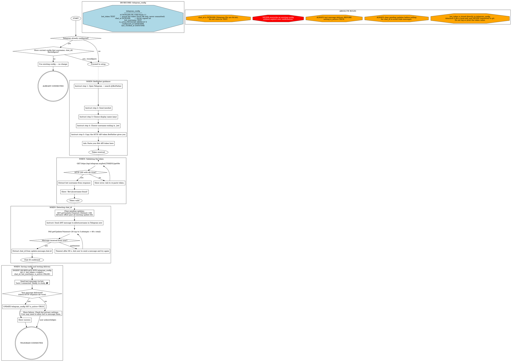

```dot
digraph inch_connect_telegram {
    // Connect Telegram
    // Guides the user through creating a Telegram bot and connecting it to Inch 3.
    // Reads: user-provided bot token. Writes: telegram_config table (bot_token stored directly in DB).
    // Tests delivery (sendMessage) before marking configuration as active.
    // Argument: none (fully interactive)

    "START" [shape=ellipse];
    "Telegram already configured?" [shape=diamond];
    "Show current config (bot username, chat_id)\nReconfigure?" [shape=diamond];
    "Use existing config — no change" [shape=box];
    "ALREADY CONNECTED" [shape=doublecircle];
    "Proceed to setup" [shape=ellipse];

    "START" -> "Telegram already configured?";
    "Telegram already configured?" -> "Show current config (bot username, chat_id)\nReconfigure?" [label="yes"];
    "Show current config (bot username, chat_id)\nReconfigure?" -> "Use existing config — no change" [label="no"];
    "Show current config (bot username, chat_id)\nReconfigure?" -> "Proceed to setup" [label="yes, reconfigure"];
    "Use existing config — no change" -> "ALREADY CONNECTED";
    "Telegram already configured?" -> "Proceed to setup" [label="no"];

    subgraph cluster_phase1 {
        label="WHEN: BotFather guidance";

        "Instruct step 1: Open Telegram → search @BotFather" [shape=box];
        "Instruct step 2: Send /newbot" [shape=box];
        "Instruct step 3: Choose display name (any)" [shape=box];
        "Instruct step 4: Choose username ending in _bot" [shape=box];
        "Instruct step 5: Copy the HTTP API token BotFather gives you" [shape=box];
        "Ask: Paste your Bot API token here" [shape=box];
        "Token received" [shape=ellipse];

        "Instruct step 1: Open Telegram → search @BotFather" -> "Instruct step 2: Send /newbot";
        "Instruct step 2: Send /newbot" -> "Instruct step 3: Choose display name (any)";
        "Instruct step 3: Choose display name (any)" -> "Instruct step 4: Choose username ending in _bot";
        "Instruct step 4: Choose username ending in _bot" -> "Instruct step 5: Copy the HTTP API token BotFather gives you";
        "Instruct step 5: Copy the HTTP API token BotFather gives you" -> "Ask: Paste your Bot API token here";
        "Ask: Paste your Bot API token here" -> "Token received";
    }

    "Proceed to setup" -> "Instruct step 1: Open Telegram → search @BotFather" [style=dotted];

    subgraph cluster_phase2 {
        label="WHEN: Validating the token";

        "GET https://api.telegram.org/bot{TOKEN}/getMe" [shape=plaintext];
        "HTTP 200 with ok=true?" [shape=diamond];
        "Extract bot username from response" [shape=box];
        "Show: 'Bot @username found'" [shape=box];
        "Show error. Ask to re-paste token." [shape=box];
        "Token valid" [shape=ellipse];

        "GET https://api.telegram.org/bot{TOKEN}/getMe" -> "HTTP 200 with ok=true?";
        "HTTP 200 with ok=true?" -> "Extract bot username from response" [label="yes"];
        "Extract bot username from response" -> "Show: 'Bot @username found'";
        "Show: 'Bot @username found'" -> "Token valid";
        "HTTP 200 with ok=true?" -> "Show error. Ask to re-paste token." [label="no"];
        "Show error. Ask to re-paste token." -> "GET https://api.telegram.org/bot{TOKEN}/getMe";
    }

    "Token received" -> "GET https://api.telegram.org/bot{TOKEN}/getMe" [style=dotted];

    subgraph cluster_phase3 {
        label="WHEN: Detecting chat_id";

        "Clear pending updates:\nGET getUpdates?timeout=0&limit=100\nAdvance offset past all existing update IDs" [shape=box];
        "Instruct: Send ANY message to @botusername in Telegram now" [shape=box];
        "Poll getUpdates?timeout=20 (up to 3 attempts = 60 s total)" [shape=plaintext];
        "Message received from user?" [shape=diamond];
        "Extract chat_id from update.message.chat.id" [shape=box];
        "Timeout after 60 s: Ask user to send a message and try again" [shape=box];
        "Chat ID confirmed" [shape=ellipse];

        "Clear pending updates:\nGET getUpdates?timeout=0&limit=100\nAdvance offset past all existing update IDs" -> "Instruct: Send ANY message to @botusername in Telegram now";
        "Instruct: Send ANY message to @botusername in Telegram now" -> "Poll getUpdates?timeout=20 (up to 3 attempts = 60 s total)";
        "Poll getUpdates?timeout=20 (up to 3 attempts = 60 s total)" -> "Message received from user?";
        "Message received from user?" -> "Extract chat_id from update.message.chat.id" [label="yes"];
        "Message received from user?" -> "Timeout after 60 s: Ask user to send a message and try again" [label="no/timeout"];
        "Timeout after 60 s: Ask user to send a message and try again" -> "Poll getUpdates?timeout=20 (up to 3 attempts = 60 s total)";
        "Extract chat_id from update.message.chat.id" -> "Chat ID confirmed";
    }

    "Token valid" -> "Clear pending updates:\nGET getUpdates?timeout=0&limit=100\nAdvance offset past all existing update IDs" [style=dotted];

    subgraph cluster_phase4 {
        label="WHEN: Saving config and testing delivery";

        "INSERT OR REPLACE INTO telegram_config\n(id=1, bot_token=<token>,\nchat_id, bot_username, is_active=FALSE)" [shape=box];
        "Send test message via bot:\n'Inch 3 connected! Ready to study. 🎓'" [shape=box];
        "Test message delivered?\n(check HTTP response ok=true)" [shape=diamond];
        "UPDATE telegram_config SET is_active=TRUE" [shape=box];
        "Show success" [shape=box];
        "Show failure. Check bot privacy settings.\nUser may need to allow bot to message them." [shape=box];
        "TELEGRAM CONNECTED" [shape=doublecircle];

        "INSERT OR REPLACE INTO telegram_config\n(id=1, bot_token=<token>,\nchat_id, bot_username, is_active=FALSE)" -> "Send test message via bot:\n'Inch 3 connected! Ready to study. 🎓'";
        "Send test message via bot:\n'Inch 3 connected! Ready to study. 🎓'" -> "Test message delivered?\n(check HTTP response ok=true)";
        "Test message delivered?\n(check HTTP response ok=true)" -> "UPDATE telegram_config SET is_active=TRUE" [label="yes"];
        "UPDATE telegram_config SET is_active=TRUE" -> "Show success";
        "Show success" -> "TELEGRAM CONNECTED";
        "Test message delivered?\n(check HTTP response ok=true)" -> "Show failure. Check bot privacy settings.\nUser may need to allow bot to message them." [label="no"];
        "Show failure. Check bot privacy settings.\nUser may need to allow bot to message them." -> "TELEGRAM CONNECTED" [label="user acknowledges"];
    }

    "Chat ID confirmed" -> "INSERT OR REPLACE INTO telegram_config\n(id=1, bot_token=<token>,\nchat_id, bot_username, is_active=FALSE)" [style=dotted];

    subgraph cluster_format {
        label="DB RECORD: telegram_config";

        "telegram_config\n──────────────────\nid INTEGER PK CHECK(id=1)\nbot_token TEXT         ← actual bot token (local DB only, never committed)\nchat_id INTEGER        ← 64-bit signed int\nbot_username TEXT\nis_active BOOLEAN DEFAULT 0\nconfigured_at DATETIME\nlast_verified_at DATETIME" [shape=octagon, style=filled, fillcolor=lightblue];
    }

    subgraph cluster_rules {
        label="ABSOLUTE RULES";

        "bot_token is stored directly in telegram_config.\ndata/inch-3.db is local-only and NEVER committed to git.\nDo not log or print the token value." [shape=octagon, style=filled, fillcolor=orange];
        "ALWAYS clear pending updates before polling\nfor chat_id to avoid stale messages." [shape=octagon, style=filled, fillcolor=orange];
        "ALWAYS test message delivery BEFORE\nsetting is_active=TRUE." [shape=octagon, style=filled, fillcolor=orange];
        "NEVER overwrite an existing config\nwithout explicit user confirmation." [shape=octagon, style=filled, fillcolor=red, fontcolor=white];
        "chat_id is INTEGER (Telegram IDs are 64-bit).\nDo not store as TEXT." [shape=octagon, style=filled, fillcolor=orange];
    }
}
```
