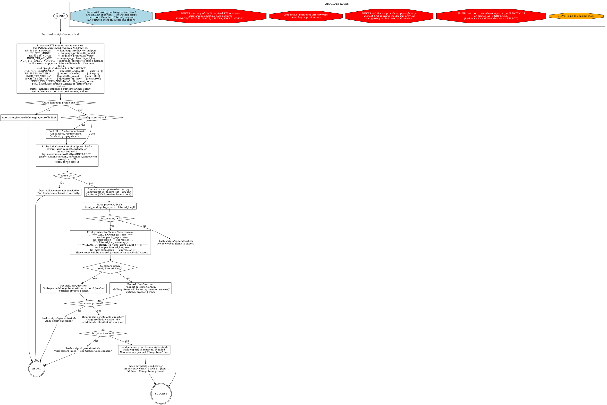

```dot
digraph inch_export_anki_cards {
    // Export Anki Cards
    // Pushes queued vocab items to Anki via AnkiConnect.
    // Reads: anki_config, language_profiles, anki_vocab_items, sentences.
    // Writes: anki_vocab_items.exported_at, anki_vocab_items.anki_note_id,
    //         anki_vocab_items.pruned_at (for items filtered by MAX_WORDS).
    //
    // ARCHITECTURE: Thin orchestration wrapper. All real work lives in
    // scripts/anki-export.py. This skill is USER-INVOKED ONLY — it is no
    // longer auto-triggered by /inch-continue at session end.
    //
    // FLOW: The skill runs the Python script twice per invocation:
    //   1. --dry-run → emits JSON preview (to_export + filtered_long)
    //   2. Claude displays the preview + asks the user to confirm
    //   3. On confirm → runs the script for real (exports + auto-prunes long)

    "START" [shape=ellipse];
    "Run: bash scripts/backup-db.sh" [shape=plaintext];
    "Pre-cache TTS credentials as env vars.\nThe Python script hard-requires ALL FIVE of:\n  INCH_TTS_ENDPOINT      ← language_profiles.tts_endpoint\n  INCH_TTS_MODEL         ← language_profiles.tts_model\n  INCH_TTS_VOICE         ← language_profiles.tts_voice\n  INCH_TTS_API_KEY       ← language_profiles.tts_api_key\n  INCH_TTS_SPEED_NORMAL  ← language_profiles.tts_speed_normal\nUse this exact snippet (no intermediate echo of values):\n  set -a\n  eval \"$(sqlite3 data/inch-3.db \\\"SELECT\n      'INCH_TTS_ENDPOINT='     || quote(tts_endpoint)     || char(10) ||\n      'INCH_TTS_MODEL='        || quote(tts_model)        || char(10) ||\n      'INCH_TTS_VOICE='        || quote(tts_voice)        || char(10) ||\n      'INCH_TTS_API_KEY='      || quote(tts_api_key)      || char(10) ||\n      'INCH_TTS_SPEED_NORMAL=' || tts_speed_normal\n    FROM language_profiles WHERE is_active=1;\\\")\"\n  set +a\nquote() handles embedded quotes/newlines safely;\nset -a / set +a exports without echoing values." [shape=box];
    "Active language profile exists?" [shape=diamond];
    "Abort: run /inch-switch-language-profile first" [shape=box];
    "anki_config.is_active = 1?" [shape=diamond];
    "Hand off to /inch-connect-anki.\nOn success, resume here.\nOn abort, propagate abort." [shape=box];
    "Probe AnkiConnect version (quick check):\nuv run --with requests python -c \"\nimport requests\ntry: r=requests.post('http://HOST:PORT',\n  json={'action':'version','version':6},timeout=5)\nexcept: exit(2)\nexit(0 if r.ok else 1)\n\"" [shape=box];
    "Probe OK?" [shape=diamond];
    "Abort: AnkiConnect not reachable.\nRun /inch-connect-anki to re-verify." [shape=box];
    "Run: uv run scripts/anki-export.py\n--lang-profile-id <active_id> --dry-run\n(captures JSON preview from stdout)" [shape=box];
    "Parse preview JSON:\n  total_pending, to_export[], filtered_long[]" [shape=box];
    "total_pending > 0?" [shape=diamond];
    "bash scripts/tg-send-text.sh\n'No new vocab items to export.'" [shape=plaintext];
    "Print preview to Claude Code console:\n  1. '== WILL EXPORT (N items) =='\n     one line per to_export row:\n       [id] expression  →  expression_l1\n  2. If filtered_long non-empty:\n     '== WILL AUTO-PRUNE (M items, word_count >= 6) =='\n     one line per filtered_long row:\n       [id] (wc) expression  →  expression_l1\n     'These items will be marked pruned_at on successful export.'" [shape=box];
    "to_export empty\n(only filtered_long)?" [shape=diamond];
    "Use AskUserQuestion:\n  'Auto-prune M long items with no export? (yes/no)'\n  options: proceed | cancel" [shape=box];
    "Use AskUserQuestion:\n  'Export N items to Anki?\n   (M long items will be auto-pruned on success)'\n  options: proceed | cancel" [shape=box];
    "User chose proceed?" [shape=diamond];
    "bash scripts/tg-send-text.sh\n'Anki export cancelled.'" [shape=plaintext];
    "Run: uv run scripts/anki-export.py\n--lang-profile-id <active_id>\n(credentials inherited via env vars)" [shape=box];
    "Script exit code 0?" [shape=diamond];
    "Read summary line from script stdout:\n'[anki-export] N exported, M failed'\nAlso note any 'pruned K long items' line." [shape=box];
    "bash scripts/tg-send-text.sh\n'Exported N cards to Inch 3 - {lang}.\nM failed, K long items pruned.'" [shape=plaintext];
    "SUCCESS" [shape=doublecircle];
    "bash scripts/tg-send-text.sh\n'Anki export failed — see Claude Code console.'" [shape=plaintext];
    "ABORT" [shape=doublecircle];

    "START" -> "Run: bash scripts/backup-db.sh";
    "Run: bash scripts/backup-db.sh" -> "Pre-cache TTS credentials as env vars.\nThe Python script hard-requires ALL FIVE of:\n  INCH_TTS_ENDPOINT      ← language_profiles.tts_endpoint\n  INCH_TTS_MODEL         ← language_profiles.tts_model\n  INCH_TTS_VOICE         ← language_profiles.tts_voice\n  INCH_TTS_API_KEY       ← language_profiles.tts_api_key\n  INCH_TTS_SPEED_NORMAL  ← language_profiles.tts_speed_normal\nUse this exact snippet (no intermediate echo of values):\n  set -a\n  eval \"$(sqlite3 data/inch-3.db \\\"SELECT\n      'INCH_TTS_ENDPOINT='     || quote(tts_endpoint)     || char(10) ||\n      'INCH_TTS_MODEL='        || quote(tts_model)        || char(10) ||\n      'INCH_TTS_VOICE='        || quote(tts_voice)        || char(10) ||\n      'INCH_TTS_API_KEY='      || quote(tts_api_key)      || char(10) ||\n      'INCH_TTS_SPEED_NORMAL=' || tts_speed_normal\n    FROM language_profiles WHERE is_active=1;\\\")\"\n  set +a\nquote() handles embedded quotes/newlines safely;\nset -a / set +a exports without echoing values.";
    "Pre-cache TTS credentials as env vars.\nThe Python script hard-requires ALL FIVE of:\n  INCH_TTS_ENDPOINT      ← language_profiles.tts_endpoint\n  INCH_TTS_MODEL         ← language_profiles.tts_model\n  INCH_TTS_VOICE         ← language_profiles.tts_voice\n  INCH_TTS_API_KEY       ← language_profiles.tts_api_key\n  INCH_TTS_SPEED_NORMAL  ← language_profiles.tts_speed_normal\nUse this exact snippet (no intermediate echo of values):\n  set -a\n  eval \"$(sqlite3 data/inch-3.db \\\"SELECT\n      'INCH_TTS_ENDPOINT='     || quote(tts_endpoint)     || char(10) ||\n      'INCH_TTS_MODEL='        || quote(tts_model)        || char(10) ||\n      'INCH_TTS_VOICE='        || quote(tts_voice)        || char(10) ||\n      'INCH_TTS_API_KEY='      || quote(tts_api_key)      || char(10) ||\n      'INCH_TTS_SPEED_NORMAL=' || tts_speed_normal\n    FROM language_profiles WHERE is_active=1;\\\")\"\n  set +a\nquote() handles embedded quotes/newlines safely;\nset -a / set +a exports without echoing values." -> "Active language profile exists?";
    "Active language profile exists?" -> "Abort: run /inch-switch-language-profile first" [label="no"];
    "Abort: run /inch-switch-language-profile first" -> "ABORT";
    "Active language profile exists?" -> "anki_config.is_active = 1?" [label="yes"];
    "anki_config.is_active = 1?" -> "Hand off to /inch-connect-anki.\nOn success, resume here.\nOn abort, propagate abort." [label="no"];
    "Hand off to /inch-connect-anki.\nOn success, resume here.\nOn abort, propagate abort." -> "Probe AnkiConnect version (quick check):\nuv run --with requests python -c \"\nimport requests\ntry: r=requests.post('http://HOST:PORT',\n  json={'action':'version','version':6},timeout=5)\nexcept: exit(2)\nexit(0 if r.ok else 1)\n\"";
    "anki_config.is_active = 1?" -> "Probe AnkiConnect version (quick check):\nuv run --with requests python -c \"\nimport requests\ntry: r=requests.post('http://HOST:PORT',\n  json={'action':'version','version':6},timeout=5)\nexcept: exit(2)\nexit(0 if r.ok else 1)\n\"" [label="yes"];
    "Probe AnkiConnect version (quick check):\nuv run --with requests python -c \"\nimport requests\ntry: r=requests.post('http://HOST:PORT',\n  json={'action':'version','version':6},timeout=5)\nexcept: exit(2)\nexit(0 if r.ok else 1)\n\"" -> "Probe OK?";
    "Probe OK?" -> "Abort: AnkiConnect not reachable.\nRun /inch-connect-anki to re-verify." [label="no"];
    "Abort: AnkiConnect not reachable.\nRun /inch-connect-anki to re-verify." -> "ABORT";
    "Probe OK?" -> "Run: uv run scripts/anki-export.py\n--lang-profile-id <active_id> --dry-run\n(captures JSON preview from stdout)" [label="yes"];
    "Run: uv run scripts/anki-export.py\n--lang-profile-id <active_id> --dry-run\n(captures JSON preview from stdout)" -> "Parse preview JSON:\n  total_pending, to_export[], filtered_long[]";
    "Parse preview JSON:\n  total_pending, to_export[], filtered_long[]" -> "total_pending > 0?";
    "total_pending > 0?" -> "bash scripts/tg-send-text.sh\n'No new vocab items to export.'" [label="no"];
    "bash scripts/tg-send-text.sh\n'No new vocab items to export.'" -> "SUCCESS";
    "total_pending > 0?" -> "Print preview to Claude Code console:\n  1. '== WILL EXPORT (N items) =='\n     one line per to_export row:\n       [id] expression  →  expression_l1\n  2. If filtered_long non-empty:\n     '== WILL AUTO-PRUNE (M items, word_count >= 6) =='\n     one line per filtered_long row:\n       [id] (wc) expression  →  expression_l1\n     'These items will be marked pruned_at on successful export.'" [label="yes"];
    "Print preview to Claude Code console:\n  1. '== WILL EXPORT (N items) =='\n     one line per to_export row:\n       [id] expression  →  expression_l1\n  2. If filtered_long non-empty:\n     '== WILL AUTO-PRUNE (M items, word_count >= 6) =='\n     one line per filtered_long row:\n       [id] (wc) expression  →  expression_l1\n     'These items will be marked pruned_at on successful export.'" -> "to_export empty\n(only filtered_long)?";
    "to_export empty\n(only filtered_long)?" -> "Use AskUserQuestion:\n  'Auto-prune M long items with no export? (yes/no)'\n  options: proceed | cancel" [label="yes"];
    "to_export empty\n(only filtered_long)?" -> "Use AskUserQuestion:\n  'Export N items to Anki?\n   (M long items will be auto-pruned on success)'\n  options: proceed | cancel" [label="no"];
    "Use AskUserQuestion:\n  'Auto-prune M long items with no export? (yes/no)'\n  options: proceed | cancel" -> "User chose proceed?";
    "Use AskUserQuestion:\n  'Export N items to Anki?\n   (M long items will be auto-pruned on success)'\n  options: proceed | cancel" -> "User chose proceed?";
    "User chose proceed?" -> "bash scripts/tg-send-text.sh\n'Anki export cancelled.'" [label="no"];
    "bash scripts/tg-send-text.sh\n'Anki export cancelled.'" -> "ABORT";
    "User chose proceed?" -> "Run: uv run scripts/anki-export.py\n--lang-profile-id <active_id>\n(credentials inherited via env vars)" [label="yes"];
    "Run: uv run scripts/anki-export.py\n--lang-profile-id <active_id>\n(credentials inherited via env vars)" -> "Script exit code 0?";
    "Script exit code 0?" -> "Read summary line from script stdout:\n'[anki-export] N exported, M failed'\nAlso note any 'pruned K long items' line." [label="yes"];
    "Read summary line from script stdout:\n'[anki-export] N exported, M failed'\nAlso note any 'pruned K long items' line." -> "bash scripts/tg-send-text.sh\n'Exported N cards to Inch 3 - {lang}.\nM failed, K long items pruned.'";
    "bash scripts/tg-send-text.sh\n'Exported N cards to Inch 3 - {lang}.\nM failed, K long items pruned.'" -> "SUCCESS";
    "Script exit code 0?" -> "bash scripts/tg-send-text.sh\n'Anki export failed — see Claude Code console.'" [label="no"];
    "bash scripts/tg-send-text.sh\n'Anki export failed — see Claude Code console.'" -> "ABORT";

    subgraph cluster_rules {
        label="ABSOLUTE RULES";
        "NEVER skip the backup step." [shape=octagon, style=filled, fillcolor=orange];
        "NEVER re-export rows where exported_at IS NOT NULL\nor pruned_at IS NOT NULL.\n(Python script enforces this via its SELECT.)" [shape=octagon, style=filled, fillcolor=red, fontcolor=white];
        "NEVER call the script with --apply-style args\nwithout first showing the dry-run preview\nand getting explicit user confirmation." [shape=octagon, style=filled, fillcolor=red, fontcolor=white];
        "Credentials: read once into env vars,\nnever log or print values." [shape=octagon, style=filled, fillcolor=red, fontcolor=white];
        "NEVER omit any of the 5 required TTS env vars.\nscripts/anki-export.py hard-requires:\nENDPOINT, MODEL, VOICE, API_KEY, SPEED_NORMAL." [shape=octagon, style=filled, fillcolor=red, fontcolor=white];
        "Items with word_count(expression) >= 6\nare NEVER exported — the Python script\npartitions them into filtered_long and\nauto-prunes them on successful export." [shape=octagon, style=filled, fillcolor=lightblue];
    }
}
```
