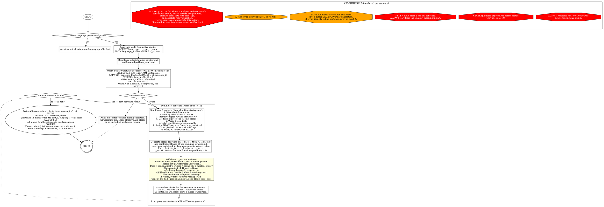

```dot
digraph inch_generate_blocks {
    // Generate Blocks for Upcoming Sentences
    // Pre-generates sentence_blocks for the next N unstudied sentences (default 10).
    // This is the ONLY skill that loads the chunking knowledge files.
    //
    // Reads: active language profile, sentences table.
    // Reads: knowledge/chunking-strategy.md — language-agnostic NP/VP framework.
    // Reads: knowledge/{lang_code}.md — language-specific patterns, examples, fixed expressions.
    //   Resolve {lang_code} from the active language profile in the DB.
    // Writes: sentence_blocks table.
    //
    // NOTE: This skill is typically invoked as a subagent from /inch-continue
    //   (via the Agent tool, model='opus') to keep the ~1,300 lines of
    //   chunking knowledge files out of the main session context.
    //   It can also be invoked directly as /inch-generate-blocks.
    //
    // IMPORTANT: Read BOTH chunking files before generating any blocks.
    //   1. knowledge/chunking-strategy.md — Phase 0 flow, NP/VP slot structure,
    //      combining phases, Absolute Rules.
    //   2. knowledge/{lang_code}.md — NP/VP pattern definitions, fixed expressions,
    //      annotated ground-truth examples, L1 translation rules.

    "START" [shape=ellipse];
    "Active language profile configured?" [shape=diamond];
    "Abort: run /inch-setup-new-language-profile first" [shape=box];
    "Load lang_code from active profile:\nSELECT lang_code, l1_code, l1_name\nFROM language_profiles WHERE is_active=1" [shape=box];
    "Read knowledge/chunking-strategy.md\nand knowledge/{lang_code}.md" [shape=box];

    "START" -> "Active language profile configured?";
    "Active language profile configured?" -> "Load lang_code from active profile:\nSELECT lang_code, l1_code, l1_name\nFROM language_profiles WHERE is_active=1" [label="yes"];
    "Active language profile configured?" -> "Abort: run /inch-setup-new-language-profile first" [label="no"];
    "Load lang_code from active profile:\nSELECT lang_code, l1_code, l1_name\nFROM language_profiles WHERE is_active=1" -> "Read knowledge/chunking-strategy.md\nand knowledge/{lang_code}.md";

    // --- Phase: Sentence Selection ---

    "Query next 10 unstudied sentences with NO existing blocks:\nSELECT s.id, s.l2_text FROM sentences s\nLEFT JOIN sentence_blocks sb ON s.id = sb.sentence_id\nWHERE s.lang_profile_id = ?\nAND s.study_status = 'unstudied'\nAND sb.id IS NULL\nORDER BY s.book_id, s.chapter_id, s.id\nLIMIT 10" [shape=box];
    "Sentences found?" [shape=diamond];
    "Print: No sentences need block generation.\nAll upcoming sentences already have blocks\nor no unstudied sentences remain." [shape=box];

    "Read knowledge/chunking-strategy.md\nand knowledge/{lang_code}.md" -> "Query next 10 unstudied sentences with NO existing blocks:\nSELECT s.id, s.l2_text FROM sentences s\nLEFT JOIN sentence_blocks sb ON s.id = sb.sentence_id\nWHERE s.lang_profile_id = ?\nAND s.study_status = 'unstudied'\nAND sb.id IS NULL\nORDER BY s.book_id, s.chapter_id, s.id\nLIMIT 10";
    "Query next 10 unstudied sentences with NO existing blocks:\nSELECT s.id, s.l2_text FROM sentences s\nLEFT JOIN sentence_blocks sb ON s.id = sb.sentence_id\nWHERE s.lang_profile_id = ?\nAND s.study_status = 'unstudied'\nAND sb.id IS NULL\nORDER BY s.book_id, s.chapter_id, s.id\nLIMIT 10" -> "Sentences found?";
    "Sentences found?" -> "Print: No sentences need block generation.\nAll upcoming sentences already have blocks\nor no unstudied sentences remain." [label="none"];
    "Print: No sentences need block generation.\nAll upcoming sentences already have blocks\nor no unstudied sentences remain." -> "DONE" [style=dotted];

    // --- Phase: Per-Sentence Block Generation Loop ---

    subgraph cluster_gen_loop {
        label="FOR EACH sentence (batch of up to 10)";

        "Run Phase 0 analysis (from chunking-strategy.md):\n1. Read the full sentence\n2. Identify main clause structure\n3. Identify subject NP and predicate VP\n4. List fixed expressions (atomic blocks)\n5. Write 4-step draft:\n   a. Label constituents grammatically\n   b. Assign NP/VP patterns from {lang_code}.md\n   c. List planned blocks with role tags\n   d. Verify all ABSOLUTE RULES" [shape=box];

        "Generate blocks following NP (Phase 1) then VP (Phase 2)\nthen combining (Phase 3) per chunking-strategy.md.\nUse {lang_code}.md for language-specific pattern rules.\nEach block: tts_text, l2_display (= tts_text),\nl1_text (L1 translation + optional usage notes), role." [shape=box];

        "Self-check l1_text naturalness:\nFor each block, re-read the l1_text Chinese portion\n(before any parenthetical annotation).\nDoes it read naturally, or does it sound like a machine gloss?\nCheck against L1-10 anti-patterns:\n- 的-chain pileup (>2 consecutive)\n- 所-被-由 literary passive (unless formal register)\n- four-character compound stacking\nIf stilted, rephrase before writing to DB.\nConsult the bad→good examples table in {lang_code}.md." [shape=box, style=filled, fillcolor=lightyellow];

        "Generate blocks following NP (Phase 1) then VP (Phase 2)\nthen combining (Phase 3) per chunking-strategy.md.\nUse {lang_code}.md for language-specific pattern rules.\nEach block: tts_text, l2_display (= tts_text),\nl1_text (L1 translation + optional usage notes), role." -> "Self-check l1_text naturalness:\nFor each block, re-read the l1_text Chinese portion\n(before any parenthetical annotation).\nDoes it read naturally, or does it sound like a machine gloss?\nCheck against L1-10 anti-patterns:\n- 的-chain pileup (>2 consecutive)\n- 所-被-由 literary passive (unless formal register)\n- four-character compound stacking\nIf stilted, rephrase before writing to DB.\nConsult the bad→good examples table in {lang_code}.md.";

        "Accumulate blocks for this sentence in memory.\nDo NOT write to DB yet — all blocks across\nall sentences are batched into a single transaction." [shape=box];

        "Print progress: Sentence M/N — K blocks generated" [shape=plaintext];

        "Run Phase 0 analysis (from chunking-strategy.md):\n1. Read the full sentence\n2. Identify main clause structure\n3. Identify subject NP and predicate VP\n4. List fixed expressions (atomic blocks)\n5. Write 4-step draft:\n   a. Label constituents grammatically\n   b. Assign NP/VP patterns from {lang_code}.md\n   c. List planned blocks with role tags\n   d. Verify all ABSOLUTE RULES" -> "Generate blocks following NP (Phase 1) then VP (Phase 2)\nthen combining (Phase 3) per chunking-strategy.md.\nUse {lang_code}.md for language-specific pattern rules.\nEach block: tts_text, l2_display (= tts_text),\nl1_text (L1 translation + optional usage notes), role.";
        "Self-check l1_text naturalness:\nFor each block, re-read the l1_text Chinese portion\n(before any parenthetical annotation).\nDoes it read naturally, or does it sound like a machine gloss?\nCheck against L1-10 anti-patterns:\n- 的-chain pileup (>2 consecutive)\n- 所-被-由 literary passive (unless formal register)\n- four-character compound stacking\nIf stilted, rephrase before writing to DB.\nConsult the bad→good examples table in {lang_code}.md." -> "Accumulate blocks for this sentence in memory.\nDo NOT write to DB yet — all blocks across\nall sentences are batched into a single transaction.";
        "Accumulate blocks for this sentence in memory.\nDo NOT write to DB yet — all blocks across\nall sentences are batched into a single transaction." -> "Print progress: Sentence M/N — K blocks generated";
    }

    "Sentences found?" -> "Run Phase 0 analysis (from chunking-strategy.md):\n1. Read the full sentence\n2. Identify main clause structure\n3. Identify subject NP and predicate VP\n4. List fixed expressions (atomic blocks)\n5. Write 4-step draft:\n   a. Label constituents grammatically\n   b. Assign NP/VP patterns from {lang_code}.md\n   c. List planned blocks with role tags\n   d. Verify all ABSOLUTE RULES" [label="found"];
    "Print progress: Sentence M/N — K blocks generated" -> "More sentences in batch?" [style=dotted];
    "More sentences in batch?" [shape=diamond];
    "More sentences in batch?" -> "Run Phase 0 analysis (from chunking-strategy.md):\n1. Read the full sentence\n2. Identify main clause structure\n3. Identify subject NP and predicate VP\n4. List fixed expressions (atomic blocks)\n5. Write 4-step draft:\n   a. Label constituents grammatically\n   b. Assign NP/VP patterns from {lang_code}.md\n   c. List planned blocks with role tags\n   d. Verify all ABSOLUTE RULES" [label="yes — next sentence"];
    "More sentences in batch?" -> "Write ALL accumulated blocks in a single sqlite3 call:\nBEGIN;\nINSERT INTO sentence_blocks\n  (sentence_id, block_order, tts_text, l2_display, l1_text, role)\nVALUES (...);\n-- all blocks for all sentences in one transaction --\nCOMMIT;\nIf error: identify failing sentence, retry without it.\nPrint summary: N sentences, K total blocks." [label="no — all done"];

    "Write ALL accumulated blocks in a single sqlite3 call:\nBEGIN;\nINSERT INTO sentence_blocks\n  (sentence_id, block_order, tts_text, l2_display, l1_text, role)\nVALUES (...);\n-- all blocks for all sentences in one transaction --\nCOMMIT;\nIf error: identify failing sentence, retry without it.\nPrint summary: N sentences, K total blocks." -> "DONE";

    "DONE" [shape=doublecircle];

    // --- Absolute Rules (inherited from chunking-strategy.md) ---

    subgraph cluster_rules {
        label="ABSOLUTE RULES (enforced per sentence)";

        "ALWAYS complete Phase 0 4-step draft\nbefore writing any blocks." [shape=octagon, style=filled, fillcolor=red, fontcolor=white];
        "NEVER split fixed expressions across blocks.\nThey are ATOMIC." [shape=octagon, style=filled, fillcolor=red, fontcolor=white];
        "NEVER make block 1 the full sentence.\nALWAYS start from the smallest meaningful unit." [shape=octagon, style=filled, fillcolor=red, fontcolor=white];
        "Batch ALL blocks across ALL sentences\ninto a single BEGIN/COMMIT transaction.\nIf error: identify failing sentence, retry without it." [shape=octagon, style=filled, fillcolor=orange];
        "l2_display is always identical to tts_text." [shape=octagon, style=filled, fillcolor=orange];
        "ALWAYS print the full Phase 0 analysis to the terminal:\nconstituent labels, NP/VP pattern assignments,\nplanned block lists with role tags,\nand absolute rule verification.\nNever suppress or abbreviate this output.\n(Required for user transparency and verification.)" [shape=octagon, style=filled, fillcolor=red, fontcolor=white];
    }
}
```
