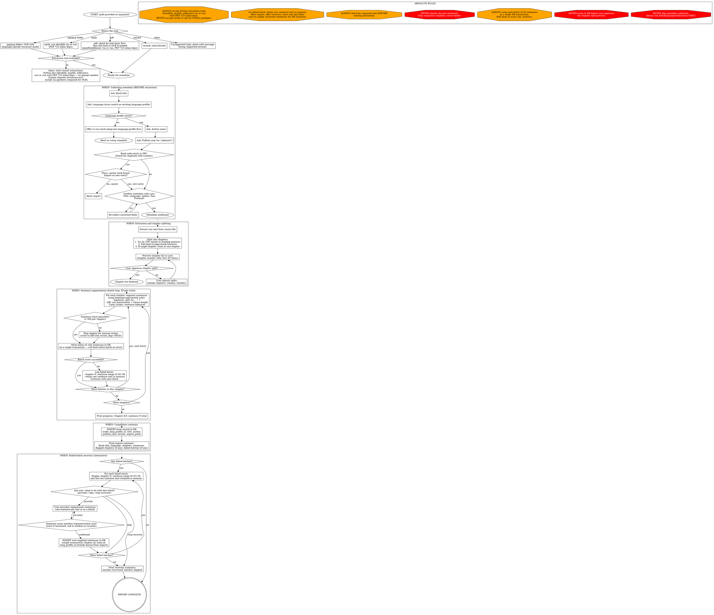

```dot
digraph inch_import_books {
    // Import Books
    // Extracts text from epub/pdf/jpg-folder/text files, splits into chapters and sentences,
    // saves to data/inch-3.db. Metadata (title, author, language, year) is collected FIRST.
    // Reads: file or folder path (argument). Writes: books, chapters, sentences tables.
    // Argument: /inch-import-books <path-to-file-or-folder>

    "START: path provided as argument" [shape=ellipse];
    "Detect file type" [shape=diamond];
    "epub: use ebooklib via uv run\n(PEP 723 inline deps)" [shape=box];
    "pdf: check for text layer first,\nthen fall back to OCR if needed\n(pypdf2/pdfminer via uv run, PEP 723 inline deps)" [shape=box];
    "jpg/png folder: OCR with\nlanguage-specific tesseract model" [shape=box];
    "txt/md: read directly" [shape=box];
    "Unsupported type: abort with message\nlisting supported formats" [shape=box];
    "Extraction tool available?" [shape=diamond];
    "Abort: show install instructions.\nPython libs (ebooklib, pypdf2, pdfminer):\n  use uv run with PEP 723 inline deps — no pip/apt needed.\nSystem binaries (tesseract-ocr):\n  install via apt/brew (required for OCR)." [shape=box];
    "Ready for metadata" [shape=ellipse];

    "START: path provided as argument" -> "Detect file type";
    "Detect file type" -> "epub: use ebooklib via uv run\n(PEP 723 inline deps)" [label="epub"];
    "Detect file type" -> "pdf: check for text layer first,\nthen fall back to OCR if needed\n(pypdf2/pdfminer via uv run, PEP 723 inline deps)" [label="pdf"];
    "Detect file type" -> "jpg/png folder: OCR with\nlanguage-specific tesseract model" [label="jpg/png folder"];
    "Detect file type" -> "txt/md: read directly" [label="txt/md"];
    "Detect file type" -> "Unsupported type: abort with message\nlisting supported formats" [label="other"];
    "epub: use ebooklib via uv run\n(PEP 723 inline deps)" -> "Extraction tool available?";
    "pdf: check for text layer first,\nthen fall back to OCR if needed\n(pypdf2/pdfminer via uv run, PEP 723 inline deps)" -> "Extraction tool available?";
    "jpg/png folder: OCR with\nlanguage-specific tesseract model" -> "Extraction tool available?";
    "txt/md: read directly" -> "Ready for metadata";
    "Extraction tool available?" -> "Ready for metadata" [label="yes"];
    "Extraction tool available?" -> "Abort: show install instructions.\nPython libs (ebooklib, pypdf2, pdfminer):\n  use uv run with PEP 723 inline deps — no pip/apt needed.\nSystem binaries (tesseract-ocr):\n  install via apt/brew (required for OCR)." [label="no"];

    subgraph cluster_phase1 {
        label="WHEN: Collecting metadata (BEFORE extraction)";

        "Ask: Book title" [shape=box];
        "Ask: Language (must match an existing language profile)" [shape=box];
        "Language profile exists?" [shape=diamond];
        "Offer to run /inch-setup-new-language-profile first" [shape=box];
        "Abort or setup complete" [shape=ellipse];
        "Ask: Author name" [shape=box];
        "Ask: Publish year (or 'unknown')" [shape=box];
        "Book code exists in DB?\n(Check for duplicate title+author)" [shape=diamond];
        "Warn: similar book found.\nImport as new entry?" [shape=diamond];
        "Abort import" [shape=box];
        "Confirm metadata with user:\nTitle, Language, Author, Year\nProceed?" [shape=diamond];
        "Re-collect corrected fields" [shape=box];
        "Metadata confirmed" [shape=ellipse];

        "Ask: Book title" -> "Ask: Language (must match an existing language profile)";
        "Ask: Language (must match an existing language profile)" -> "Language profile exists?";
        "Language profile exists?" -> "Ask: Author name" [label="yes"];
        "Language profile exists?" -> "Offer to run /inch-setup-new-language-profile first" [label="no"];
        "Offer to run /inch-setup-new-language-profile first" -> "Abort or setup complete";
        "Ask: Author name" -> "Ask: Publish year (or 'unknown')";
        "Ask: Publish year (or 'unknown')" -> "Book code exists in DB?\n(Check for duplicate title+author)";
        "Book code exists in DB?\n(Check for duplicate title+author)" -> "Confirm metadata with user:\nTitle, Language, Author, Year\nProceed?" [label="no"];
        "Book code exists in DB?\n(Check for duplicate title+author)" -> "Warn: similar book found.\nImport as new entry?" [label="yes"];
        "Warn: similar book found.\nImport as new entry?" -> "Confirm metadata with user:\nTitle, Language, Author, Year\nProceed?" [label="yes, new entry"];
        "Warn: similar book found.\nImport as new entry?" -> "Abort import" [label="no, cancel"];
        "Confirm metadata with user:\nTitle, Language, Author, Year\nProceed?" -> "Metadata confirmed" [label="yes"];
        "Confirm metadata with user:\nTitle, Language, Author, Year\nProceed?" -> "Re-collect corrected fields" [label="no"];
        "Re-collect corrected fields" -> "Confirm metadata with user:\nTitle, Language, Author, Year\nProceed?";
    }

    "Ready for metadata" -> "Ask: Book title" [style=dotted];

    subgraph cluster_phase2 {
        label="WHEN: Extraction and chapter splitting";

        "Extract raw text from source file" [shape=box];
        "Split into chapters:\n1. Try by TOC (epub) or heading patterns\n2. Fall back to page-break heuristic\n3. If single-chapter: treat as one chapter" [shape=box];
        "Preview chapter list to user\n(chapter number, title, first 50 chars)" [shape=box];
        "User approves chapter split?" [shape=diamond];
        "User adjusts splits\n(merge chapters, rename, reorder)" [shape=box];
        "Chapter list finalised" [shape=ellipse];

        "Extract raw text from source file" -> "Split into chapters:\n1. Try by TOC (epub) or heading patterns\n2. Fall back to page-break heuristic\n3. If single-chapter: treat as one chapter";
        "Split into chapters:\n1. Try by TOC (epub) or heading patterns\n2. Fall back to page-break heuristic\n3. If single-chapter: treat as one chapter" -> "Preview chapter list to user\n(chapter number, title, first 50 chars)";
        "Preview chapter list to user\n(chapter number, title, first 50 chars)" -> "User approves chapter split?";
        "User approves chapter split?" -> "Chapter list finalised" [label="yes"];
        "User approves chapter split?" -> "User adjusts splits\n(merge chapters, rename, reorder)" [label="no"];
        "User adjusts splits\n(merge chapters, rename, reorder)" -> "Preview chapter list to user\n(chapter number, title, first 50 chars)";
    }

    "Metadata confirmed" -> "Extract raw text from source file" [style=dotted];

    subgraph cluster_phase3 {
        label="WHEN: Sentence segmentation (batch loop, 50 per write)";

        "For each chapter: segment sentences\nusing language-appropriate rules:\n- Japanese: split on 。！？\n- CJK: use punctuation + clause length\n- Latin scripts: sentence tokenizer" [shape=box];
        "Sentence count plausible?\n(1–500 per chapter)" [shape=diamond];
        "Flag chapter for manual review\n(write to DB with review_flag=TRUE)" [shape=box];
        "Write batch of ≤50 sentences to DB\n(in a single transaction — roll back entire batch on error)" [shape=box];
        "Batch write succeeded?" [shape=diamond];
        "Log failed batch:\n- chapter N, sentence range M–M+50\n- retain raw sentence text in memory\nContinue with next batch" [shape=box];
        "More batches in this chapter?" [shape=diamond];
        "More chapters?" [shape=diamond];
        "Print progress: Chapter X/Y, sentence N total" [shape=box];

        "For each chapter: segment sentences\nusing language-appropriate rules:\n- Japanese: split on 。！？\n- CJK: use punctuation + clause length\n- Latin scripts: sentence tokenizer" -> "Sentence count plausible?\n(1–500 per chapter)";
        "Sentence count plausible?\n(1–500 per chapter)" -> "Write batch of ≤50 sentences to DB\n(in a single transaction — roll back entire batch on error)" [label="yes"];
        "Sentence count plausible?\n(1–500 per chapter)" -> "Flag chapter for manual review\n(write to DB with review_flag=TRUE)" [label="no"];
        "Flag chapter for manual review\n(write to DB with review_flag=TRUE)" -> "Write batch of ≤50 sentences to DB\n(in a single transaction — roll back entire batch on error)";
        "Write batch of ≤50 sentences to DB\n(in a single transaction — roll back entire batch on error)" -> "Batch write succeeded?";
        "Batch write succeeded?" -> "More batches in this chapter?" [label="yes"];
        "Batch write succeeded?" -> "Log failed batch:\n- chapter N, sentence range M–M+50\n- retain raw sentence text in memory\nContinue with next batch" [label="no"];
        "Log failed batch:\n- chapter N, sentence range M–M+50\n- retain raw sentence text in memory\nContinue with next batch" -> "More batches in this chapter?";
        "More batches in this chapter?" -> "For each chapter: segment sentences\nusing language-appropriate rules:\n- Japanese: split on 。！？\n- CJK: use punctuation + clause length\n- Latin scripts: sentence tokenizer" [label="yes, next batch"];
        "More batches in this chapter?" -> "More chapters?" [label="no"];
        "More chapters?" -> "For each chapter: segment sentences\nusing language-appropriate rules:\n- Japanese: split on 。！？\n- CJK: use punctuation + clause length\n- Latin scripts: sentence tokenizer" [label="yes"];
        "More chapters?" -> "Print progress: Chapter X/Y, sentence N total" [label="no"];
    }

    "Chapter list finalised" -> "For each chapter: segment sentences\nusing language-appropriate rules:\n- Japanese: split on 。！？\n- CJK: use punctuation + clause length\n- Latin scripts: sentence tokenizer" [style=dotted];

    subgraph cluster_phase4 {
        label="WHEN: Completion summary";

        "INSERT book record to DB\n(code, lang_profile_id, title, author,\npublish_year, format, import_path)" [shape=box];
        "Print import summary:\nBook title, language, chapters, sentences,\nflagged chapters (if any), failed batches (if any)" [shape=box];

        "INSERT book record to DB\n(code, lang_profile_id, title, author,\npublish_year, format, import_path)" -> "Print import summary:\nBook title, language, chapters, sentences,\nflagged chapters (if any), failed batches (if any)";
    }

    "Print progress: Chapter X/Y, sentence N total" -> "INSERT book record to DB\n(code, lang_profile_id, title, author,\npublish_year, format, import_path)" [style=dotted];

    subgraph cluster_phase5 {
        label="WHEN: Failed batch recovery (interactive)";

        "Any failed batches?" [shape=diamond];
        "For each failed batch:\nDisplay chapter N, sentence range M–M+50,\nand the raw sentence text retained in memory" [shape=box];
        "Ask user: what to do with this batch?\n(provide / skip / stop recovery)" [shape=diamond];
        "User provides replacement sentences\n(one sentence per line or as a block)" [shape=box];
        "Sentence count matches expected batch size?\n(warn if mismatch, ask to confirm or re-enter)" [shape=diamond];
        "INSERT user-supplied sentences to DB\n(single transaction; chapter_id, book_id,\nlang_profile_id already known from import)" [shape=box];
        "More failed batches?" [shape=diamond];
        "Print recovery summary:\nbatches recovered, batches skipped" [shape=box];
        "IMPORT COMPLETE" [shape=doublecircle];

        "Any failed batches?" -> "For each failed batch:\nDisplay chapter N, sentence range M–M+50,\nand the raw sentence text retained in memory" [label="yes"];
        "Any failed batches?" -> "IMPORT COMPLETE" [label="no"];
        "For each failed batch:\nDisplay chapter N, sentence range M–M+50,\nand the raw sentence text retained in memory" -> "Ask user: what to do with this batch?\n(provide / skip / stop recovery)";
        "Ask user: what to do with this batch?\n(provide / skip / stop recovery)" -> "User provides replacement sentences\n(one sentence per line or as a block)" [label="provide"];
        "Ask user: what to do with this batch?\n(provide / skip / stop recovery)" -> "More failed batches?" [label="skip"];
        "Ask user: what to do with this batch?\n(provide / skip / stop recovery)" -> "Print recovery summary:\nbatches recovered, batches skipped" [label="stop recovery"];
        "User provides replacement sentences\n(one sentence per line or as a block)" -> "Sentence count matches expected batch size?\n(warn if mismatch, ask to confirm or re-enter)";
        "Sentence count matches expected batch size?\n(warn if mismatch, ask to confirm or re-enter)" -> "INSERT user-supplied sentences to DB\n(single transaction; chapter_id, book_id,\nlang_profile_id already known from import)" [label="confirmed"];
        "Sentence count matches expected batch size?\n(warn if mismatch, ask to confirm or re-enter)" -> "User provides replacement sentences\n(one sentence per line or as a block)" [label="re-enter"];
        "INSERT user-supplied sentences to DB\n(single transaction; chapter_id, book_id,\nlang_profile_id already known from import)" -> "More failed batches?";
        "More failed batches?" -> "For each failed batch:\nDisplay chapter N, sentence range M–M+50,\nand the raw sentence text retained in memory" [label="yes"];
        "More failed batches?" -> "Print recovery summary:\nbatches recovered, batches skipped" [label="no"];
        "Print recovery summary:\nbatches recovered, batches skipped" -> "IMPORT COMPLETE";
    }

    "Print import summary:\nBook title, language, chapters, sentences,\nflagged chapters (if any), failed batches (if any)" -> "Any failed batches?" [style=dotted];

    subgraph cluster_rules {
        label="ABSOLUTE RULES";

        "NEVER skip metadata collection.\nAlways ask title/language/author/year FIRST." [shape=octagon, style=filled, fillcolor=red, fontcolor=white];
        "NEVER write to DB before user approves\nthe chapter split preview." [shape=octagon, style=filled, fillcolor=red, fontcolor=white];
        "ALWAYS wrap each batch of 50 sentences\nin a single DB transaction.\nRoll back on error, log, continue." [shape=octagon, style=filled, fillcolor=orange];
        "NEVER silently discard sentences.\nFlag suspicious chapters; never delete." [shape=octagon, style=filled, fillcolor=red, fontcolor=white];
        "ALWAYS check for required tools BEFORE\nstarting extraction." [shape=octagon, style=filled, fillcolor=orange];
        "On failed batch: retain raw sentence text in memory.\nAfter import, offer recovery: show text and allow\nuser to supply corrected sentences for DB insertion." [shape=octagon, style=filled, fillcolor=orange];
        "ALWAYS invoke Python extraction tools\n(ebooklib, pypdf2, pdfminer) via uv run\nwith PEP 723 inline deps.\nNEVER use pip install or apt for Python packages." [shape=octagon, style=filled, fillcolor=orange];
    }
}
```
