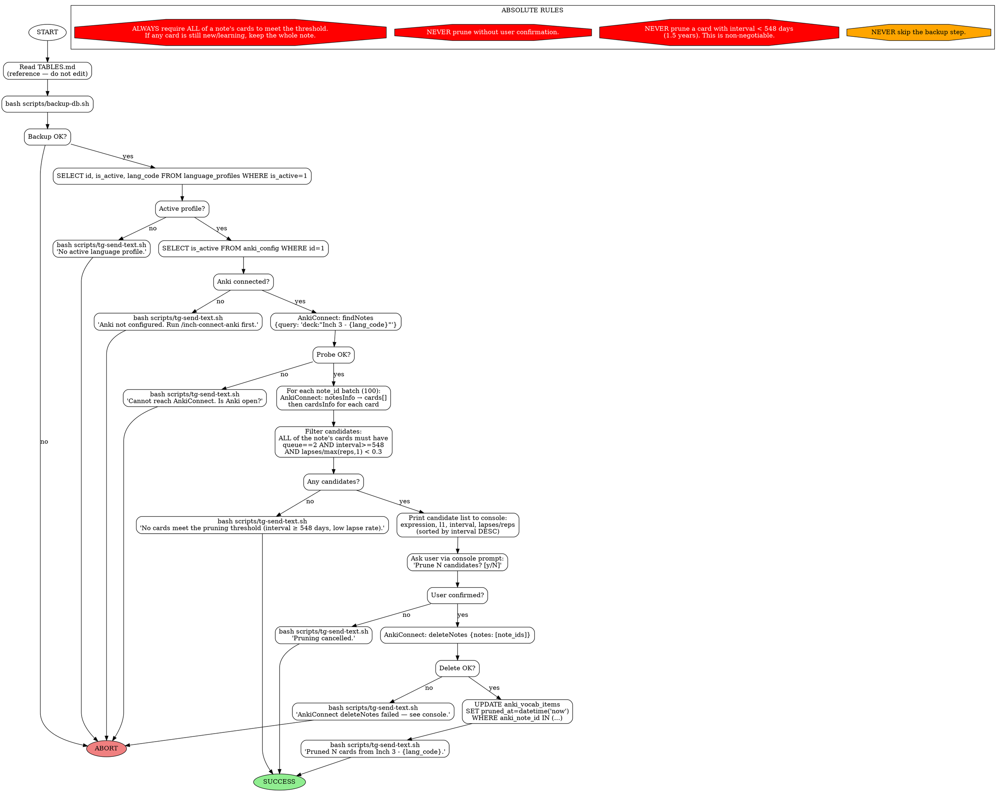

```dot
digraph inch_prune_anki {
    rankdir=TB;
    node [shape=box, style=rounded];

    START [shape=oval];
    SUCCESS [shape=oval, style=filled, fillcolor=lightgreen];
    ABORT [shape=oval, style=filled, fillcolor=lightcoral];

    START -> "Read TABLES.md\n(reference — do not edit)";
    "Read TABLES.md\n(reference — do not edit)" -> "bash scripts/backup-db.sh";
    "bash scripts/backup-db.sh" -> "Backup OK?";
    "Backup OK?" -> ABORT [label="no"];
    "Backup OK?" -> "SELECT id, is_active, lang_code FROM language_profiles WHERE is_active=1" [label="yes"];

    "SELECT id, is_active, lang_code FROM language_profiles WHERE is_active=1" -> "Active profile?";
    "Active profile?" -> "bash scripts/tg-send-text.sh\n'No active language profile.'" [label="no"];
    "bash scripts/tg-send-text.sh\n'No active language profile.'" -> ABORT;

    "Active profile?" -> "SELECT is_active FROM anki_config WHERE id=1" [label="yes"];
    "SELECT is_active FROM anki_config WHERE id=1" -> "Anki connected?";
    "Anki connected?" -> "bash scripts/tg-send-text.sh\n'Anki not configured. Run /inch-connect-anki first.'" [label="no"];
    "bash scripts/tg-send-text.sh\n'Anki not configured. Run /inch-connect-anki first.'" -> ABORT;

    "Anki connected?" -> "AnkiConnect: findNotes\n{query: 'deck:\"Inch 3 - {lang_code}\"'}" [label="yes"];
    "AnkiConnect: findNotes\n{query: 'deck:\"Inch 3 - {lang_code}\"'}" -> "Probe OK?";
    "Probe OK?" -> "bash scripts/tg-send-text.sh\n'Cannot reach AnkiConnect. Is Anki open?'" [label="no"];
    "bash scripts/tg-send-text.sh\n'Cannot reach AnkiConnect. Is Anki open?'" -> ABORT;

    "Probe OK?" -> "For each note_id batch (100):\nAnkiConnect: notesInfo → cards[]\nthen cardsInfo for each card" [label="yes"];
    "For each note_id batch (100):\nAnkiConnect: notesInfo → cards[]\nthen cardsInfo for each card" -> "Filter candidates:\nALL of the note's cards must have\nqueue==2 AND interval>=548\nAND lapses/max(reps,1) < 0.3";
    "Filter candidates:\nALL of the note's cards must have\nqueue==2 AND interval>=548\nAND lapses/max(reps,1) < 0.3" -> "Any candidates?";
    "Any candidates?" -> "bash scripts/tg-send-text.sh\n'No cards meet the pruning threshold (interval ≥ 548 days, low lapse rate).'" [label="no"];
    "bash scripts/tg-send-text.sh\n'No cards meet the pruning threshold (interval ≥ 548 days, low lapse rate).'" -> SUCCESS;

    "Any candidates?" -> "Print candidate list to console:\nexpression, l1, interval, lapses/reps\n(sorted by interval DESC)" [label="yes"];
    "Print candidate list to console:\nexpression, l1, interval, lapses/reps\n(sorted by interval DESC)" -> "Ask user via console prompt:\n'Prune N candidates? [y/N]'";
    "Ask user via console prompt:\n'Prune N candidates? [y/N]'" -> "User confirmed?";
    "User confirmed?" -> "bash scripts/tg-send-text.sh\n'Pruning cancelled.'" [label="no"];
    "bash scripts/tg-send-text.sh\n'Pruning cancelled.'" -> SUCCESS;

    "User confirmed?" -> "AnkiConnect: deleteNotes {notes: [note_ids]}" [label="yes"];
    "AnkiConnect: deleteNotes {notes: [note_ids]}" -> "Delete OK?";
    "Delete OK?" -> "bash scripts/tg-send-text.sh\n'AnkiConnect deleteNotes failed — see console.'" [label="no"];
    "bash scripts/tg-send-text.sh\n'AnkiConnect deleteNotes failed — see console.'" -> ABORT;

    "Delete OK?" -> "UPDATE anki_vocab_items\nSET pruned_at=datetime('now')\nWHERE anki_note_id IN (...)" [label="yes"];
    "UPDATE anki_vocab_items\nSET pruned_at=datetime('now')\nWHERE anki_note_id IN (...)" -> "bash scripts/tg-send-text.sh\n'Pruned N cards from Inch 3 - {lang_code}.'";
    "bash scripts/tg-send-text.sh\n'Pruned N cards from Inch 3 - {lang_code}.'" -> SUCCESS;

    subgraph cluster_rules {
        label="ABSOLUTE RULES";
        "NEVER skip the backup step." [shape=octagon, style=filled, fillcolor=orange];
        "NEVER prune a card with interval < 548 days\n(1.5 years). This is non-negotiable." [shape=octagon, style=filled, fillcolor=red, fontcolor=white];
        "NEVER prune without user confirmation." [shape=octagon, style=filled, fillcolor=red, fontcolor=white];
        "ALWAYS require ALL of a note's cards to meet the threshold.\nIf any card is still new/learning, keep the whole note." [shape=octagon, style=filled, fillcolor=red, fontcolor=white];
    }
}
```
