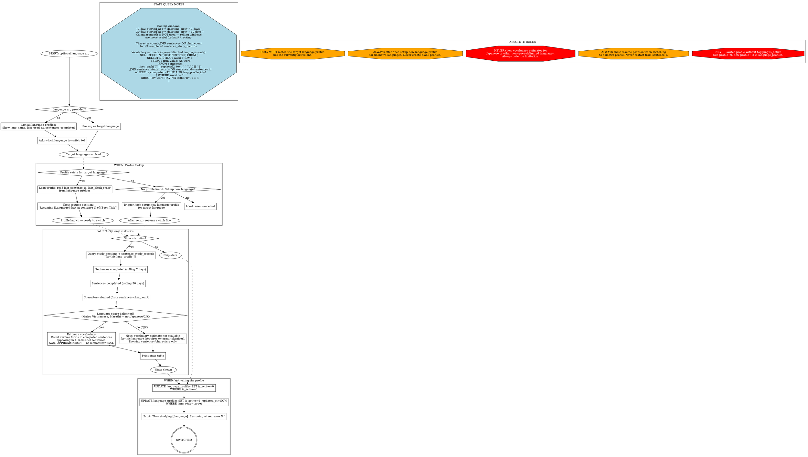

```dot
digraph inch_switch_language_profile {
    // Switch Language Profile
    // Changes the active language profile. Shows optional learning statistics.
    // For new languages, triggers /inch-setup-new-language-profile.
    // Reads: language_profiles, study_sessions, sentence_study_records from DB.
    // Writes: language_profiles.is_active, language_profiles.updated_at.
    // Argument: optional language name, e.g. /inch-switch-language-profile Japanese

    "START: optional language arg" [shape=ellipse];
    "Language arg provided?" [shape=diamond];
    "List all language profiles:\nShow lang_name, last_used_at, sentences_completed" [shape=box];
    "Ask: which language to switch to?" [shape=box];
    "Use arg as target language" [shape=box];
    "Target language resolved" [shape=ellipse];

    "START: optional language arg" -> "Language arg provided?";
    "Language arg provided?" -> "Use arg as target language" [label="yes"];
    "Language arg provided?" -> "List all language profiles:\nShow lang_name, last_used_at, sentences_completed" [label="no"];
    "List all language profiles:\nShow lang_name, last_used_at, sentences_completed" -> "Ask: which language to switch to?";
    "Ask: which language to switch to?" -> "Target language resolved";
    "Use arg as target language" -> "Target language resolved";

    subgraph cluster_phase1 {
        label="WHEN: Profile lookup";

        "Profile exists for target language?" [shape=diamond];
        "Load profile: read last_sentence_id, last_block_order\nfrom language_profiles" [shape=box];
        "Show resume position:\n'Resuming [Language]: last at sentence N of [Book Title]'" [shape=box];
        "Profile known — ready to switch" [shape=ellipse];
        "No profile found. Set up new language?" [shape=diamond];
        "Trigger /inch-setup-new-language-profile\nfor target language" [shape=box];
        "After setup: resume switch flow" [shape=ellipse];
        "Abort: user cancelled" [shape=box];

        "Profile exists for target language?" -> "Load profile: read last_sentence_id, last_block_order\nfrom language_profiles" [label="yes"];
        "Load profile: read last_sentence_id, last_block_order\nfrom language_profiles" -> "Show resume position:\n'Resuming [Language]: last at sentence N of [Book Title]'";
        "Show resume position:\n'Resuming [Language]: last at sentence N of [Book Title]'" -> "Profile known — ready to switch";
        "Profile exists for target language?" -> "No profile found. Set up new language?" [label="no"];
        "No profile found. Set up new language?" -> "Trigger /inch-setup-new-language-profile\nfor target language" [label="yes"];
        "Trigger /inch-setup-new-language-profile\nfor target language" -> "After setup: resume switch flow";
        "No profile found. Set up new language?" -> "Abort: user cancelled" [label="no"];
    }

    "Target language resolved" -> "Profile exists for target language?" [style=dotted];

    subgraph cluster_phase2 {
        label="WHEN: Optional statistics";

        "Show statistics?" [shape=diamond];
        "Query study_sessions + sentence_study_records\nfor this lang_profile_id" [shape=box];
        "Sentences completed (rolling 7 days)" [shape=box];
        "Sentences completed (rolling 30 days)" [shape=box];
        "Characters studied (from sentences.char_count)" [shape=box];
        "Language space-delimited?\n(Malay, Vietnamese, Marathi — not Japanese/CJK)" [shape=diamond];
        "Estimate vocabulary:\nCount surface forms in completed sentences\nappearing in ≥ 3 distinct sentences.\nNote: APPROXIMATION — no lemmatizer used." [shape=box];
        "Note: vocabulary estimate not available\nfor this language (requires external tokenizer).\nShowing sentences/characters only." [shape=box];
        "Print stats table" [shape=box];
        "Stats shown" [shape=ellipse];
        "Skip stats" [shape=ellipse];

        "Show statistics?" -> "Query study_sessions + sentence_study_records\nfor this lang_profile_id" [label="yes"];
        "Query study_sessions + sentence_study_records\nfor this lang_profile_id" -> "Sentences completed (rolling 7 days)";
        "Sentences completed (rolling 7 days)" -> "Sentences completed (rolling 30 days)";
        "Sentences completed (rolling 30 days)" -> "Characters studied (from sentences.char_count)";
        "Characters studied (from sentences.char_count)" -> "Language space-delimited?\n(Malay, Vietnamese, Marathi — not Japanese/CJK)";
        "Language space-delimited?\n(Malay, Vietnamese, Marathi — not Japanese/CJK)" -> "Estimate vocabulary:\nCount surface forms in completed sentences\nappearing in ≥ 3 distinct sentences.\nNote: APPROXIMATION — no lemmatizer used." [label="yes"];
        "Language space-delimited?\n(Malay, Vietnamese, Marathi — not Japanese/CJK)" -> "Note: vocabulary estimate not available\nfor this language (requires external tokenizer).\nShowing sentences/characters only." [label="no (CJK)"];
        "Estimate vocabulary:\nCount surface forms in completed sentences\nappearing in ≥ 3 distinct sentences.\nNote: APPROXIMATION — no lemmatizer used." -> "Print stats table";
        "Note: vocabulary estimate not available\nfor this language (requires external tokenizer).\nShowing sentences/characters only." -> "Print stats table";
        "Print stats table" -> "Stats shown";
        "Show statistics?" -> "Skip stats" [label="no"];
    }

    "Profile known — ready to switch" -> "Show statistics?" [style=dotted];
    "After setup: resume switch flow" -> "Show statistics?" [style=dotted];

    subgraph cluster_phase3 {
        label="WHEN: Activating the profile";

        "UPDATE language_profiles SET is_active=0\nWHERE is_active=1" [shape=box];
        "UPDATE language_profiles SET is_active=1, updated_at=NOW\nWHERE lang_code=target" [shape=box];
        "Print: 'Now studying [Language]. Resuming at sentence N.'" [shape=box];
        "SWITCHED" [shape=doublecircle];

        "UPDATE language_profiles SET is_active=0\nWHERE is_active=1" -> "UPDATE language_profiles SET is_active=1, updated_at=NOW\nWHERE lang_code=target";
        "UPDATE language_profiles SET is_active=1, updated_at=NOW\nWHERE lang_code=target" -> "Print: 'Now studying [Language]. Resuming at sentence N.'";
        "Print: 'Now studying [Language]. Resuming at sentence N.'" -> "SWITCHED";
    }

    "Stats shown" -> "UPDATE language_profiles SET is_active=0\nWHERE is_active=1" [style=dotted];
    "Skip stats" -> "UPDATE language_profiles SET is_active=0\nWHERE is_active=1" [style=dotted];

    subgraph cluster_format {
        label="STATS QUERY NOTES";

        "Rolling windows:\n- 7-day: started_at >= datetime('now', '-7 days')\n- 30-day: started_at >= datetime('now', '-30 days')\nCalendar month is NOT used — rolling windows\nare more useful for habit tracking.\n\nCharacter count: JOIN sentences ON char_count\nfor all completed sentence_study_records.\n\nVocabulary estimate (space-delimited languages only):\nSELECT COUNT(DISTINCT word) FROM (\n  SELECT DISTINCT word FROM (\n    SELECT trim(value) AS word\n    FROM sentences,\n    json_each('[\"' || replace(l2_text, ' ', '\",\"') || '\"]')\n    JOIN sentence_study_records ON sentence_id=sentences.id\n    WHERE is_completed=TRUE AND lang_profile_id=?\n  ) WHERE word != ''\n  GROUP BY word HAVING COUNT(*) >= 3\n)" [shape=octagon, style=filled, fillcolor=lightblue];
    }

    subgraph cluster_rules {
        label="ABSOLUTE RULES";

        "NEVER switch profile without toggling is_active\n(old profile→0, new profile→1) in language_profiles." [shape=octagon, style=filled, fillcolor=red, fontcolor=white];
        "ALWAYS show resume position when switching\nto a known profile. Never restart from sentence 1." [shape=octagon, style=filled, fillcolor=orange];
        "NEVER show vocabulary estimates for\nJapanese or other non-space-delimited languages.\nAlways note the limitation." [shape=octagon, style=filled, fillcolor=red, fontcolor=white];
        "ALWAYS offer /inch-setup-new-language-profile\nfor unknown languages. Never create blank profiles." [shape=octagon, style=filled, fillcolor=orange];
        "Stats MUST match the target language profile,\nnot the currently active one." [shape=octagon, style=filled, fillcolor=orange];
    }
}
```
