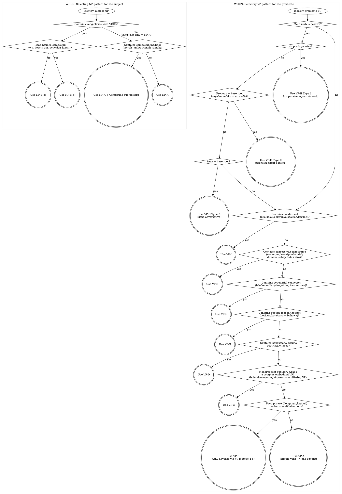

# Malay (msa) — Language-Specific Chunking Reference

This file is consulted alongside `knowledge/chunking-strategy.md` when generating blocks for Malay sentences. It defines the language-specific content for each pattern slot (NP-A, NP-B, VP-A–I) and provides annotated ground-truth examples.

**L1:** Traditional Chinese (繁體中文, Taiwan)



---

## L1 Register Target

Natural Taiwanese Mandarin as spoken by an educated adult in Taipei. Translations should read like something a Taiwanese speaker would actually say in everyday conversation — not literal word-for-word glosses, not formal/literary Chinese, not Mainland-register phrasing. If a draft reads like Google Translate output, revise it.

### Anti-patterns (Mandarin L1)

- **的-chain pileup**: avoid more than two consecutive `的` in a single noun phrase. Restructure with a relative clause, appositive, or split sentence.
- **所-被-由 literary passive**: do not use `所` / `被...所` / `由...所` chains unless the L2 register is explicitly formal/literary.
- **Four-character compound stacking**: avoid piling 成語 / 四字格 to sound "literary". Plain words are usually better.
- **Translationese copula**: do not translate every English/Malay "is" with `是` — Mandarin often drops it, or uses a different construction.
- **Pronoun over-specification**: Mandarin drops pronouns readily; do not preserve every L2 pronoun.

Consult these anti-patterns during the /inch-generate-blocks self-check step.

---

## Writing System & Phonology (Quick Reference)

**Script:** Rumi (Latin). Largely phonemic (one letter ≈ one sound). Jawi (Arabic-based) exists historically but is not relevant for TTS.

**Critical vowel distinction:** The letter **e** represents TWO phonemes — pepet (schwa /ə/, as in `emak` /əmak/) and taling (close-mid /e/, as in `merah` /merah/). Not distinguished in writing. All prefixes (me-, ber-, ter-, per-, ke-, se-) use pepet.

**Digraphs:** `ng` /ŋ/, `ny` /ɲ/, `sy` /ʃ/, `kh` /x/, `gh` /ɣ/. Word-initial `ng` is common (`nganga`). Word-final `k` → glottal stop /ʔ/ (similar to Cantonese 入聲).

**Stress:** Penultimate syllable. Exception: if penultimate contains schwa, stress shifts to final syllable.

**Syllable structure:** CV or CVC. No consonant clusters in native words.

---

## Morphology Overview (Load-bearing for VP Identification)

Malay is **SVO, right-branching, agglutinative-isolating**. The main grammatical complexity is the verb affix system.

### Verb Affix Table

| Surface form | Voice/Category | Example |
|---|---|---|
| meN- + root | Active (actor-focus) | membaca (reads) |
| di- + root | Passive type 1 (patient-focus) | dibaca (is read) |
| PRO + root (bare) | Passive type 2 (pronoun-agent; standard: 1st/2nd person; colloquial: 3rd person `dia` also occurs) | saya baca |
| ber- + root | Intransitive / stative | berjalan (walks) |
| ter- + root | Accidental / superlative | terjatuh (fell accidentally), terbesar (biggest) |
| meN- + root + -kan | Active causative/benefactive | memberikan (gives to) |
| meN- + root + -i | Active locative/repetitive | mendekati (approaches) |
| di- + root + -kan | Passive causative | dibesarkan (was raised/enlarged) |
| di- + root + -i | Passive locative | didekati (was approached) |

### meN- Prefix Nasal Assimilation Rules

| Root begins with | Prefix form | Root letter | Example |
|---|---|---|---|
| b | mem- | retained | beli → membeli |
| p | mem- | **dropped** | pukul → memukul |
| d | men- | retained | dapat → mendapat |
| t | men- | **dropped** | tulis → menulis |
| c, j | men- | retained | cari → mencari, jual → menjual |
| g | meng- | retained | goreng → menggoreng |
| k | meng- | **dropped** | kira → mengira |
| vowel, h | meng- | retained | ambil → mengambil, hantar → menghantar |
| s | meny- | **dropped** | sapu → menyapu |
| sy | meny- | retained | syarat → mensyaratkan |
| f | mem- | retained | fikir → memikirkan |
| v | mem- | retained | variasi → memvariasikan |
| l, r, w, y | me- | retained | lukis → melukis, rasa → merasa, wujud → mewujudkan |
| m | mem- | retained | minta → meminta, minum → meminum |
| n | men- | retained | nyanyi → menyanyi, naik → menaiki |
| monosyllabic root | menge- | retained (overrides all above) | cat → mengecat, bom → mengebom |

**peN-** (agentive/instrumental nominalizer) follows identical rules: penulis (writer), pembeli (buyer), penyapu (broom), penggoreng (frying pan).

### Key Suffixes

| Suffix | Function | Example |
|---|---|---|
| -kan | Causative/benefactive | dudukkan (seat someone), belikan (buy for someone) |
| -i | Locative/repetitive | duduki (occupy a place), ikuti (follow ongoing) |
| -an | Nominalizer | makanan (food), tulisan (writing), bacaan (reading material) |

### Circumfixes

| Circumfix | Output | Example |
|---|---|---|
| meN-...-kan | Active causative verb | membersihkan (to clean), menyelesaikan (to resolve) |
| meN-...-i | Active locative verb | menduduki (to occupy), menghormati (to respect) |
| peN-...-an | Process/abstract noun | pendidikan (education), pembuatan (manufacturing) |
| ke-...-an | Abstract noun / accidental | kecantikan (beauty), kehujanan (caught in rain) |
| ber-...-an | Reciprocal/scattered | bersalaman (shake hands), berjatuhan (falling scattered) |

### Reduplication

- **Full:** rumah-rumah (houses), berlari-lari (running around)
- **Partial/rhythmic:** sayur-mayur (vegetables), lauk-pauk (side dishes), warna-warni (colourful)
- All reduplicated forms are treated as **single atomic units** — never split across the hyphen.

---

## Discourse Particles (Always Atomic with Host Word)

### -lah (emphasis/softener/finality)
- Imperative softener: `pergilah!` (just go!)
- Finality: `sudahlah.` (enough already)
- Emphasis: `memang begitulah.` (that's exactly how it is)
- Always ONE block: `pergilah`, `sudahlah`, `begitulah`, `habislah`

### -kah (question marker)
- Formal yes/no: `adakah dia datang?` (did he come?)
- Focus question: `benarkah ini?` (is this true?)
- Always ONE block: `adakah`, `benarkah`, `apakah`, `siapakah`, `bilakah`

### -tah (uncertainty — rare/literary)
- Key fixed expression: `apatah lagi` (let alone / what more) — always atomic

### -nya (definiteness/possessive/nominalizer)
- 3rd-person possessive: `rumahnya` (his/her house)
- Definitizer: `bukunya itu` (that book of his)
- Nominalizer: `kebenarannya` (its truth)
- Adverbial: `sebenarnya` (actually), `rupanya` (apparently), `akhirnya` (finally)
- Always fused: never split `sebenar` from `-nya`

---

## Phase 0: Malay-Specific Analysis Notes

**Main clause types:**
- `A) [NP subject] + [VP predicate]` — standard SVO clause
- `B) [NP with yang-relative clause] + [VP predicate]` — subject modified by embedded verb phrase via `yang`
- `C) [NP] + copula/predicate NP` — nominal/adjectival predicate (copula: ialah/adalah/merupakan or zero)
- `D) Grammatical fragment` — excerpt ending mid-clause

**Subject NP identification:**
- Head noun comes FIRST (right-branching). All modifiers follow: adjectives, possessives, demonstratives, `yang`-clauses.
- No case-marking particles. Subject identified by position (before verb) and semantics.
- Possessive: head noun + possessor (no marker): `rumah Ali` (Ali's house), `buku saya` (my book)
- `yang` introduces relative clauses: `orang yang berlari` (the person who runs)
- Demonstratives `itu`/`ini` come after adjectives: `rumah besar itu` (that big house)
- Full NP order: **[Num+CLF] + HEAD + ADJ(s) + POSS + yang-RC + DEM**
  (Note: DEM `itu`/`ini` comes AFTER the `yang`-clause in surface form)

**Classifier system:** When counting, use numeral + classifier + noun:
- `orang` (humans), `ekor` (animals), `buah` (general/large inanimate), `batang` (long objects), `helai` (flat/thin), `biji` (small/round), `keping` (slices/flat pieces)
- `se-` + CLF = indefinite article: `sebuah rumah` (a house), `seorang guru` (a teacher)

**Fixed expressions — always one atomic block:**
```
oleh sebab itu     /  kerana itu         /  dengan itu
di samping itu     /  pada masa yang sama /  selain daripada itu
walau bagaimanapun /  namun demikian     /  dalam pada itu
tidak dapat tidak  /  tidak hairanlah    /  sudah tentu
bukan sahaja…malah /  sama ada…ataupun   /  sekali gus
terima kasih       /  minta maaf         /  selamat datang
sebenarnya         /  rupanya            /  akhirnya
```

**Negation system (four distinct negators):**

| Negator | Domain | Example |
|---|---|---|
| tidak / tak | Verbs, adjectives | tidak makan (don't eat), tidak besar (not big) |
| bukan | Nouns, identity, contrastive (also adjectives in contrastive/emphatic context) | bukan guru (not a teacher), bukan dia (not him), bukan bodoh tetapi malas (not stupid but lazy) |
| belum | "Not yet" (expected events) | belum datang (hasn't come yet) |
| jangan | Prohibition/imperative | jangan pergi! (don't go!) |

---

## NP-A: Simple NP (right-branching modifier chain, no yang-relative clause)

**Trigger:** Head noun + any combination of: adjectives, possessives, demonstratives (`ini`/`itu`), `yang`+adjective (no verb clause). No embedded verb clause.

**Key rule:** Malay NPs build LEFT TO RIGHT — head noun first, then each modifier extending rightward.

### Steps

**Step 1:** Introduce HEAD NOUN alone.
- `rumah` ← head noun
- `kereta` ← head noun

**Step 2:** Add ONE modifier at a time, expanding RIGHTWARD (adjective → possessive → demonstrative):
- `rumah` → `rumah besar` → `rumah besar itu`
- `buku` → `buku merah` → `buku merah saya`

**Step 3:** If any modifier is a compound (e.g. `kereta api`, `merah jambu`), apply Compound sub-pattern FIRST, then attach.
- `kereta api` → `kereta api laju` → `kereta api laju itu`

---

## NP-B(a): NP with yang-relative clause — simple head noun

**Trigger:** Head noun (simple, 1–2 elements) is modified by a `yang`-clause containing a verb phrase.

**Example:** `lelaki yang berlari di sana itu` (the man who is running there)

### Steps

**Step 1:** Introduce the head noun first, with any close modifiers.
- `lelaki` → `lelaki itu`

**Step 2:** Build the `yang`-relative clause SEPARATELY (SVO within the clause):
- `yang berlari` → `yang berlari di sana`

**Step 3:** Attach the fully-built `yang`-clause to the NP:
- `lelaki yang berlari di sana itu`

---

## NP-B(b): NP with yang-relative clause — compound head noun

**Trigger:** Head noun is a compound (requiring multi-step build) AND modified by a `yang`-clause.

**Example:** `bangunan pencakar langit yang dibina oleh syarikat itu` (the skyscraper built by that company)

### Steps

**Step 1:** Build the inner compound NP (head noun from inside out, rightward):
- `langit` → `pencakar langit` → `bangunan pencakar langit`

**Step 2:** Build the `yang`-clause standalone:
- `yang dibina oleh syarikat itu`

**Step 3 — MODIFICATION REVELATION BLOCK:** Attach `yang`-clause to the compound NP. In Malay, `yang` itself serves as the revelation pivot (unlike Japanese の-stem trick). Introduce compound head first, then deliver `yang + VP` as the attachment block.
- `bangunan pencakar langit yang dibina` ← pause before full extension

**Step 4:** Full NP with all elements:
- `bangunan pencakar langit yang dibina oleh syarikat itu`

---

## NP Sub-pattern: Compound Modifier

**Trigger:** Multi-element modifier functioning as a unit: compound adjectives (`merah jambu` = pink), compound nouns as modifiers (`kereta api` = train), reduplicated forms (`anak-anak` = children).

### Steps

**Step 1:** Introduce the specifying/dependent element alone (the element that narrows the meaning):
- `jambu` → l1: 番石榴（修飾限定詞）
- For `kereta api`: `api` → l1: 火（修飾限定詞）

**Step 2:** Build full compound by combining with the head element:
- `merah jambu` → l1: 粉紅色 (head `merah` + specifier `jambu`)
- `kereta api` → l1: 火車 (head `kereta` + specifier `api`)

**Step 3:** Attach compound to the NP:
- `baju merah jambu`

**Reduplication:** Introduce base form first (`rumah`), then reduplicated form (`rumah-rumah`), then attach to NP (`rumah-rumah tua itu`).

---

## VP-A: Simple verb ± directly attached adverb or auxiliary

**Trigger:** VP has a single main verb (with its meN-/ber-/di-/ter- affix) and optionally one adverb or auxiliary. No internally modifiable phrase. No second clause.

**Examples:** `membaca` (reads), `sudah pergi` (has gone), `berlari pantas` (runs fast)

### Steps

**Step 1:** Introduce main verb alone (with full affix):
- `membaca` → l1: 閱讀（meN-主動）
- `berlari` → l1: 跑步（ber-自動詞）

**Step 2:** Add auxiliary/adverb to the LEFT (pre-verbal) or RIGHT (post-verbal manner):
- Pre-verbal: `sudah membaca` → l1: 已經讀了
- Post-verbal manner: `berlari pantas` → l1: 快速地跑
- `dengan` + adj (simple): `berlari dengan cepat` → VP-A step 2

**Note:** Most manner adverbs follow the verb in Malay. Temporal adverbs and aspect markers precede.

---

## VP-B: VP with manner/location phrase built around an internal modifiable noun

**Trigger:** A phrase (prepositional or `dengan`+NP) contains a noun that is itself modified. Typical: `dengan + NP`, `di + NP`, `ke + NP`, `dari + NP` where the NP has adjectives or `yang`-clauses.

DO NOT use VP-A for this predicate. When VP-B is active, ALL adverbs are sequenced within VP-B steps 4–6.

**Example:** `berjalan dengan langkah yang perlahan` (walks with slow steps)

### Steps

**Step 1:** Introduce the core noun of the phrase alone:
- `langkah` → l1: 步伐

**Step 2:** Build the prepositional phrase around it. Label as `（固定句型）` only if genuinely idiomatic:
- `dengan langkah` → l1: 用步伐（介詞片語）

**Step 3:** Expand by adding modifiers to its internal noun (rightward):
- `dengan langkah yang perlahan` → l1: 用緩慢的步伐

**Step 4:** Introduce standalone adverbs in SURFACE ORDER (temporal → locative → manner). Each gets its own block:
- `setiap hari` → l1: 每天

**Step 5:** Introduce main verb alone:
- `berjalan` → l1: 走路

**Step 6:** Combine adverb(s) + verb:
- `setiap hari berjalan`

**Step 7:** Attach manner/location phrase → full VP:
- `berjalan dengan langkah yang perlahan setiap hari`

> Malay word order: manner phrases (`dengan + NP`) typically FOLLOW the verb.

---

## VP-C: Modal or auxiliary expression wrapping an embedded clause

**Trigger:** Modal/aspect auxiliary wrapping a VP that itself requires multi-step building. Malay auxiliaries: `boleh` (can), `dapat` (able), `harus`/`mesti` (must), `ingin`/`mahu`/`hendak` (want), `sudah`/`telah` (perfective), `sedang` (progressive), `akan` (future), `cuba` (try), `mungkin` (maybe).

**Stacking order:** `[Negation] + [Modal] + [Aspect] + [Main Verb]`
(e.g., `tidak boleh sudah makan` — cannot have eaten; modals scope over aspect markers)

**Modal expressions (atomic):** `nampaknya` (it seems), `boleh jadi` (could be), `seolah-olah` (as if), `tidak syak lagi` (without doubt), `sudah tentu` (certainly), `tidak mustahil` (possibly)

### Steps

**Step 1:** Build the embedded VP using VP-A or VP-B, from object/complement outward:
- `perkara itu` → `memahami perkara itu`

**Step 2:** Introduce the modal/auxiliary expression AS A STANDALONE block:
- `mungkin sudah boleh` → l1: 或許已經可以

**Step 3:** Attach modal to embedded clause (full VP):
- `mungkin sudah boleh memahami perkara itu`

> **Stacking rule:** 1–2 auxiliaries → single block. 3+ auxiliaries → build innermost outward: `boleh` → `sudah boleh` → `mahu sudah boleh`.

---

## VP-D: Restrictive focus — `hanya`/`sahaja`/`cuma` + negation or contrast

**Trigger:** Restrictive focus using `hanya` (only, pre-verbal), `sahaja` (only, post-verbal), `cuma` (just), often with negation.

**Example:** `hanya dapat menunggu sahaja` (can only wait)

### Steps

**Step 1:** Object NP head alone:
- `menunggu` → l1: 等待

**Step 2:** Attach restriction marker:
- `hanya menunggu` / `menunggu sahaja` → l1: 只是等待

**Step 3:** Verb in base form (if not already introduced):
- `dapat` → l1: 能夠

**Step 4:** Build the restricted construction:
- `hanya dapat menunggu sahaja` → l1: 只能等待而已

**Step 5:** Combine with remaining elements → full VP.

---

## VP-E: Concessive or scene-frame adverbial clause

**Trigger:** Concessive: `walaupun` (although), `meskipun` (even though), `sungguhpun` (literary), `biarpun` (even if). Simultaneous: `sambil` (while doing). Free-choice/universal: `di mana sahaja` (wherever), `bila-bila masa` (whenever), `tidak kira` (no matter).

> Note: Free-choice phrases (`di mana sahaja`, `tidak kira`) are domain-quantifiers, not true concessives, but are chunked identically (standalone frame → main clause).

**Example:** `walaupun penat, dia tetap bekerja`

### Steps

**Step 1:** Introduce the concessive/frame clause as STANDALONE block:
- `walaupun penat` → l1: 雖然疲倦

**Step 2:** Build the main predicate clause using VP-A/B/C/D.

**Step 3:** Prepend the concessive to the built VP:
- `walaupun penat, dia tetap bekerja`

---

## VP-F: Sequential clause (two actions joined by `lalu`/`kemudian`/`dan`)

**Trigger:** Two actions joined by sequential connector: `lalu` (then), `kemudian` (afterwards), `dan` (and), `selepas itu` (after that). NOT `sambil` (simultaneous — see VP-E).

**Example:** `dia membuka pintu lalu masuk ke dalam bilik`

### Steps

**Step 1:** Build the first action clause independently using VP-A/B:
- `membuka pintu` → l1: 打開門

**Step 2:** Build the second (main) action clause:
- `masuk ke dalam bilik` → l1: 進入房間

**Step 3:** Combine first clause + connector + main clause:
- `membuka pintu lalu masuk ke dalam bilik`

---

## VP-G: Quoted speech or thought (`berkata bahawa` / `kata` / `rasa`)

**Trigger:** Quoting verb + reported speech/thought. Complementizer `bahawa` (that) introduces formal reported speech.

**Example:** `dia berkata bahawa dia tidak akan datang`

### Steps

**Step 1:** Build the quoted clause as embedded clause using VP-A/B/C:
- `tidak akan datang` → l1: 不會來

**Step 2:** Introduce the quoting verb alone:
- `berkata bahawa` → l1: 說道

**Step 3:** Combine quoted clause + quoting verb:
- `berkata bahawa dia tidak akan datang`

---

## VP-H: Passive main predicate

Malay has two productive passive constructions.

### VP-H Type 1: di- passive (any agent)

**Trigger:** Main verb bears `di-` prefix. Agent (if expressed) introduced by `oleh` (by).

**Example:** `buku itu dibaca oleh Ali`

**Step 1:** Introduce agent + `oleh` alone:
- `oleh Ali` → l1: 被阿里

**Step 2:** Introduce passive verb alone:
- `dibaca` → l1: 閱讀（被動）

**Step 3:** Combine agent + passive verb:
- `dibaca oleh Ali` → l1: 被阿里閱讀

> Agentless passive: steps 1–2 collapse; introduce `dibaca` alone.

### VP-H Type 2: Pronoun-agent passive (1st/2nd person only)

**Trigger:** 1st/2nd person pronoun (`saya`, `aku`, `kamu`, `awak`) appears BEFORE bare root verb (no `di-`). In **standard formal Malay**, restricted to 1st/2nd person. In **colloquial Malay**, 3rd person `dia` also occurs in topic-prominent contexts (`buku itu dia baca`) — tag as `VP-H Type 2 (colloquial)` when encountered.

**Example:** `buku itu saya baca` (the book, I read)

**Step 1:** Introduce agent pronoun alone:
- `saya` → l1: 我（動作者）

**Step 2:** Introduce bare root verb alone:
- `baca` → l1: 讀（無前綴被動）

**Step 3:** Combine pronoun + root:
- `saya baca` → l1: 我來讀（物件焦點被動）

> **Critical note:** Bare root in Type 2 looks identical to colloquial active. Chunking cue: pronoun + bare root verb (NO meN- prefix) with a preceding NP topic = Type 2 passive. The morphological absence of meN- is the key signal, not just the topic NP.

### VP-H Type 3: `kena` passive (colloquial adversative)

**Trigger:** Colloquial adversative/undesirable passive using `kena` + bare root. Agent typically omitted. Strongly marks undesirable outcome.

**Examples:** `dia kena marah` (he got scolded), `kereta saya kena curi` (my car got stolen), `saya kena tipu` (I was cheated)

**Steps:**

**Step 1:** Introduce the `kena` + verb as a single block:
- `kena marah` → l1: 被罵了（kena被動，不好的事）

**Step 2:** Combine with subject → full sentence.

> Note: `kena` passive is very common in everyday speech and informal writing but is non-standard in formal prose. Tag as `VP-H Type 3`.

---

## VP-I: Conditional clause

**Trigger:** `jika`/`jikalau` (if, formal), `kalau` (if, colloquial), `sekiranya` (if, formal), `andaikata` (supposing), `asalkan` (as long as), `kecuali` (unless).

**Example:** `kalau hujan, perlawanan akan ditangguhkan`

### Steps

**Step 1:** Build the protasis (condition) using VP-A/B:
- `kalau hujan` → l1: 如果下雨

**Step 2:** Build the apodosis (result):
- `perlawanan akan ditangguhkan` → l1: 比賽將會延期

**Step 3:** Combine protasis + apodosis:
- `kalau hujan, perlawanan akan ditangguhkan`

---

## Phase 3: Malay Combining Notes

**Copula sentences (ialah / adalah / merupakan / zero):**
- Zero copula for predicate adjectives: `Dia baik.` (She is good.) — no separate penultimate VP block.
- `ialah`/`adalah`/`merupakan`: short copulas, no separate penultimate VP block needed.
- Longer predicate NPs: penultimate = predicate NP alone, final = full sentence.

**Short subject — adverb ordering:**
- SCENE-SETTING TEMPORAL/LOCATIVE FRAME (`semalam`, `di sana`, `pada waktu itu`, `setiap pagi`) → introduce adverb FIRST, then attach subject: `semalam` → `semalam dia`
- Adverb directly modifies the VERB (`dengan cepat`, `segera`) → introduce subject first: `dia` → `dia dengan cepat`

**Topicalisation / left-dislocation:**
Malay frequently fronts objects: `Buku itu, saya sudah baca.` Treat the fronted element as a scene-setting frame (VP-E step 1 equivalent).

**Passive and `yang` interaction:**
- Passive inside `yang`-clause → NP-B (not VP-H): `buku yang dibaca oleh pelajar itu`
- Passive as main predicate → VP-H: `Buku itu dibaca oleh pelajar.`

---

## Relative and Complex Clause Reference

### Relative clauses with `yang`
- Subject-gap: `orang yang membaca buku itu` (person who reads the book)
- Object-gap: `buku yang saya baca` (book that I read)
- `yang` + adjective nominalizer: `yang besar` (the big one), `yang paling mahal` (the most expensive one)
- Always POST-nominal (unlike Japanese pre-nominal relatives)

### Complement clauses
- `bahawa`/`bahwa`: `Dia tahu bahawa saya datang.` (He knows that I came.) — often omitted colloquially
- `untuk` (purposive): `Dia datang untuk belajar.` (He came to study.)
- `supaya`/`agar` (purpose with subject shift): `Saya ajar dia supaya dia faham.`

### Adverbial clauses
- Temporal: `sebelum` (before), `selepas`/`setelah` (after), `ketika`/`semasa` (when), `sejak` (since), `sementara` (while)
- Conditional: `jika`/`kalau` (if), `sekiranya` (if formal), `kecuali` (unless), `asalkan` (as long as)
- Concessive: `walaupun`/`meskipun`/`sungguhpun` (although), `biarpun` (even if)
- Causal: `kerana`/`sebab` (because)
- Purpose: `supaya`/`agar` (so that), `untuk` (in order to)

---

## Annotated Samples (ground truth — never contradict these)

### S1 — NP-A + VP-A (Active, meN- verb) — short subject
```
Ali membaca buku itu di perpustakaan.
(Ali reads that book in the library.)

[1] buku itu                  VP-A object: head noun + demonstrative
[2] di perpustakaan           locative phrase standalone
[3] membaca                   VP-A step 1: main verb (meN- active)
[4] membaca buku itu          VP-A step 2: verb + object
[5] membaca buku itu di perpustakaan  VP-A full VP (PENULTIMATE)
[6] Ali membaca buku itu di perpustakaan.  full sentence

Gloss: Ali [meN-baca] [buku itu] [di perpustakaan]
       Ali reads[ACTIVE] book that at library
```

### S2 — NP-B(a) + VP-A — `yang` relative clause
```
Lelaki yang memakai baju merah itu datang.
(The man who is wearing the red shirt came.)

[1] lelaki                              NP-B(a) step 1: head noun
[2] yang memakai                        NP-B(a) step 2a: yang + verb
[3] yang memakai baju merah             NP-B(a) step 2b: extend clause
[4] lelaki yang memakai baju merah itu  NP-B(a) step 3: attach
[5] datang                              VP-A step 1: verb (PENULTIMATE)
[6] full sentence
```

### S3 — NP-B(a) + VP-H Type 1 (di- passive) — long/complex subject
```
Laporan yang ditulis oleh pegawai itu telah dihantar kepada menteri.
(The report written by that officer has been sent to the minister.)

[1] laporan                             NP-B(a) step 1: head noun
[2] yang ditulis                        NP-B(a) step 2: yang-clause head (with yang)
[3] yang ditulis oleh pegawai itu       NP-B(a) step 2: expand with agent phrase
[4] laporan yang ditulis oleh pegawai itu  NP-B(a) step 3: full subject NP
[5] dihantar                            VP-H step 2: passive verb (agentless — step 1 collapsed)
[6] dihantar kepada menteri             VP-H step 3: passive + recipient
[7] telah dihantar kepada menteri       VP-C aspect marker + VP-H (PENULTIMATE)
[8] full sentence

Gloss: [Laporan [yang di-tulis oleh pegawai itu]] [telah di-hantar kepada menteri]
       report   that PASS-write by  officer  that  PERF  PASS-send  to   minister
```

### S4 — short subject (frame adverb first) + VP-C (modal stack)
```
Semalam dia tidak dapat tidur dengan nyenyak.
(Yesterday he was not able to sleep soundly.)

[1] semalam                          short subject path: frame adverb first
[2] semalam dia                      subject attached to frame
[3] tidur                            VP-C step 1: embedded verb
[4] tidur dengan nyenyak             VP-C step 1: add manner adverb
[5] tidak dapat                      VP-C step 2: modal standalone (negation + modal)
[6] tidak dapat tidur dengan nyenyak  VP-C step 3: modal + embedded VP (PENULTIMATE)
[7] full sentence

Gloss: Semalam dia [tidak] [dapat] [tidur] [dengan nyenyak]
       Yesterday he  NEG    able    sleep   with  soundly
```

### S5 — VP-H Type 2 (pronoun passive) + VP-F (sequential)
```
Surat itu saya tulis kemudian saya hantar kepada ibu.
(That letter, I wrote [it] and then sent [it] to mother.)

[1] surat itu                          NP-A: head noun + demonstrative (topicalised object)
[2] saya                               VP-H Type 2 step 1: agent pronoun
[3] tulis                              VP-H Type 2 step 2: bare root verb
[4] saya tulis                         VP-H Type 2 step 3: pronoun + bare root
[5] hantar kepada ibu                  VP-F step 2: second action + beneficiary
[6] saya hantar kepada ibu             VP-F step 2: second action with agent
[7] saya tulis kemudian saya hantar kepada ibu  VP-F step 3: sequential (PENULTIMATE)
[8] full sentence

Gloss: [Surat itu] [saya tulis] kemudian [saya hantar] [kepada ibu]
       letter that  I  write[PASS2]  then     I  send[PASS2]  to     mother
```

### S6 — VP-B (manner phrase with modifiable noun) — short subject
```
Dia berjalan di sepanjang jalan yang sempit itu.
(He walks along that narrow road.)

[1] jalan                              VP-B step 1: core noun of phrase
[2] di sepanjang jalan                 VP-B step 2: prepositional phrase
[3] di sepanjang jalan yang sempit itu VP-B step 3: expand with modifier
[4] berjalan                           VP-B step 5: main verb
[5] berjalan di sepanjang jalan yang sempit itu  VP-B step 7: full VP (PENULTIMATE)
[6] full sentence

Gloss: Dia [ber-jalan] [di sepanjang] [jalan yang sempit itu]
       He  walk[INTR]   along          road  REL  narrow that
```

### S7 — VP-E concessive + VP-A — short subject
```
Walaupun penat, dia tetap bekerja.
(Although tired, he still works.)

[1] walaupun penat                     VP-E step 1: concessive standalone
[2] bekerja                            VP-E step 2 (VP-A): main verb
[3] tetap bekerja                      VP-E step 2: add adverb
[4] tetap bekerja                      (same — PENULTIMATE as full main VP)
[5] full sentence

Gloss: [Walaupun penat], dia [tetap] [bekerja]
       although  tired   he  still   work[INTR]
```

### S8 — VP-I conditional with VP-A apodosis
```
Kalau kamu rajin belajar, kamu akan berjaya.
(If you study diligently, you will succeed.)

[1] belajar                         VP-I protasis VP-A: verb
[2] rajin belajar                   VP-I protasis: manner + verb
[3] kalau kamu rajin belajar        VP-I step 1: full protasis
[4] berjaya                         VP-I apodosis VP-A: verb
[5] akan berjaya                    VP-I apodosis: future marker + verb
[6] kamu akan berjaya               VP-I step 2: full apodosis (PENULTIMATE)
[7] full sentence
```

---

## L1 Translation Rules (Traditional Chinese, Taiwan)

**L1-1:** Each block's l1 translates ONLY the tts content of THAT block — never the full sentence.

**L1-2:** Fixed expressions — add `（固定句型）`:
- `oleh sebab itu` → `因此（固定句型）`
- `terima kasih` → `謝謝（固定句型）`
- `walau bagaimanapun` → `然而（固定句型）`

**L1-3:** Verb affixes — annotate the voice/type in parentheses:
- meN- active: `membaca` → `閱讀（meN-主動）`
- di- passive: `dibaca` → `（被）閱讀（di-被動）`
- ber- intransitive: `berlari` → `跑步（ber-自動詞）`
- ter- accidental: `terjatuh` → `不小心跌倒（ter-意外）`
- ter- superlative: `terbesar` → `最大的（ter-最高級）`

**L1-4:** Simpulan bahasa (idioms) — add `（慣用語）`:
- `keras kepala` → `固執（慣用語）`

**L1-5:** `l2_display` = `tts_text` exactly. No annotations or additions.

**L1-6:** Register matching: formal written Malay (`kerana`, `ialah`, `walau bagaimanapun`) → formal but modern Chinese (書面語, not 文言文). Colloquial Malay (`sebab`, `tak`, `tapi`) → natural spoken Chinese (口語).

**L1-7:** Modifier order — translate into natural Chinese word order (pre-nominal), not Malay order:
- `rumah besar itu` → `那間大房子` (not word-by-word `房子大那個`)

**L1-8:** `yang` in relative clauses → natural Chinese 的 construction:
- `buku yang dia beli` → `他買的書`

**L1-9:** Malay classifiers — map each Malay classifier to its semantically appropriate Chinese counterpart; never default to 個 for all:
- `orang` → 位 (respectful) / 個 (neutral): `tiga orang guru` → `三位老師`
- `ekor` → 隻/條: `dua ekor kucing` → `兩隻貓`; `tiga ekor ikan` → `三條魚`
- `buah` → 間 (buildings) / 台 (machines) / 個 (generic): `sebuah rumah` → `一間房子`; `sebuah televisyen` → `一台電視`
- `batang` → 支/根: `sebatang pen` → `一支筆`
- `helai` → 張/片/件: `sehelai kertas` → `一張紙`; `sehelai baju` → `一件衣服`
- `biji` → 顆/粒: `sebiji telur` → `一顆蛋`
- `keping` → 片/塊: `sekeping roti` → `一片麵包`

**L1-10:** Chinese anti-patterns — Avoid these in l1_text:
- (a) More than two consecutive 的 in a chain (rephrase to break up)
- (b) 所-被-由 literary passive constructions unless the Malay source uses formal register
- (c) Four-character compound stacking without a natural connecting word (e.g., 精神驅策日常生活)
- When structural mapping from Malay produces awkward Chinese, rephrase idiomatically. Meaning must be preserved but syntactic structure need not mirror the source.

**L1-11:** Annotation format — Structure: `{natural Chinese}（annotation）`. The Chinese portion before the parenthetical must be a complete, natural translation that stands alone. Annotations (meN-主動, 固定句型, 慣用語, etc.) go in full-width parentheses after.

### L1 Translation Examples (bad → good)

Real corrections from study sessions. Consult these before writing l1_text.

| Malay block | Bad l1_text | Good l1_text | Why bad |
|---|---|---|---|
| yang terhasil daripada pacuan semangat dalam menempuhi kehidupan sehari-hari | 由面對日常生活的精神驅策所產生的（ter-自然產生） | 從面對每天生活的那股拼勁中淬煉出來的（ter-自然產生的結果） | 所-由 literary passive; 的-chain pileup; reads like machine translation |

*(Add more rows as corrections arise in study sessions.)*

---

## Pattern Selection Guide (Malay)

| Sentence feature | NP pattern | VP pattern |
|---|---|---|
| NP with only adjectives / demonstratives / possessives | NP-A | — |
| `yang` + adjective only (no verb clause) | NP-A | — |
| NP with `yang`-relative clause; simple head noun | NP-B(a) | — |
| NP with `yang`-relative clause; compound head noun | NP-B(b) | — |
| Compound colour/modifier (`merah jambu`, `kereta api`) | NP-A + Compound sub | — |
| Reduplication (`rumah-rumah`, `anak-anak`) | NP-A + Compound sub | — |
| Single verb ± one adverb/auxiliary | — | VP-A |
| `dengan` + adjective (no modifiable noun) | — | VP-A (step 2) |
| `dengan`/`di`/`ke`/`dari` + NP with internal modifier | — | VP-B |
| Modal/aspect auxiliary wrapping complex VP | — | VP-C |
| `hanya`/`sahaja`/`cuma` restriction | — | VP-D |
| `walaupun`/`meskipun` concessive, scene-frame | — | VP-E |
| Sequential actions with `lalu`/`kemudian`/`dan`/`sambil` | — | VP-F |
| Quoted speech/thought with `bahawa`/`kata`/`berkata` | — | VP-G |
| `di-` prefix passive (any agent via `oleh`) | — | VP-H Type 1 |
| Pronoun + bare root (1st/2nd person object-focus) | — | VP-H Type 2 |
| `kena` + bare root (colloquial adversative passive) | — | VP-H Type 3 |
| `sambil` (simultaneous action) | — | VP-E |
| `jika`/`kalau`/`sekiranya` conditional | — | VP-I |

---

## Prepositions Quick-Reference

| Malay | Meaning | Notes |
|---|---|---|
| di | at/in/on (location) | NEVER direction; `di sekolah` (at school) |
| ke | to (direction) | movement toward |
| dari | from (place/time) | physical origin |
| daripada | from (person/source/comparison) | `lebih besar daripada` (bigger than) |
| untuk | for (purpose/beneficiary) | |
| dengan | with / by means of | accompaniment OR manner |
| tentang / mengenai | about / concerning | |
| pada | at (time), contact/possession, opinion frames | `pada hari Isnin` (on Monday), `pada pendapat saya` (in my opinion), `ada pada dia` (he has it) |
| kepada | to (dative/recipient) | distinct from `ke` (physical movement): `memberikan kepada Ali` (give to Ali) |
| oleh | by (passive agent) | marks agent in di- passive constructions |
| tanpa | without | |
| terhadap | towards / with regard to | attitude or obligation: `sikap terhadap` (attitude toward) |
| bagi | for (beneficiary, formal) | `bagi negara` (for the country); more formal than `untuk` |

**Multi-word prepositions (always atomic):**
`di antara` · `di dalam` · `di luar` · `di atas` · `di bawah` · `di hadapan` · `di belakang` · `di sebelah` · `di tengah` · `di sepanjang` · `di sebalik` · `ke dalam` · `selain daripada`

---

## Conjunctions Quick-Reference

**Coordinating:** `dan` (and), `atau` (or), `tetapi`/`tapi` (but), `malah` (moreover), `serta` (and also)

**Subordinating:**
- Causal: `kerana` (formal) / `sebab` (colloquial) — because
- Purpose: `supaya`/`agar` (so that), `untuk` (in order to)
- Conditional: `jika` (formal) / `kalau` (colloquial) — if; `sekiranya` (formal if); `asalkan` (as long as)
- Concessive: `walaupun`/`meskipun` (although); `biarpun` (even if)
- Temporal: `sebelum` (before), `selepas`/`setelah` (after), `ketika`/`semasa` (when), `sejak` (since), `sementara` (while)
- Simultaneous: `sambil` (while doing — same subject, concurrent action; triggers VP-E, not VP-F)
- Sequential: `lalu` (then), `kemudian` (afterwards)
- Complementizer: `bahawa` (that — for reported speech)

**Correlative pairs (each half = one block):**
`bukan sahaja…malah…` (not only…but also), `sama ada…ataupun…` (whether…or)

---

## Temporal/Aspect Markers Quick-Reference

| Marker | Function | Position |
|---|---|---|
| sudah / telah | Perfective (completed) | pre-verbal |
| sedang / tengah | Progressive (ongoing) | pre-verbal |
| akan | Future / prospective | pre-verbal |
| belum | Not yet | pre-verbal |
| pernah | Experiential (ever) | pre-verbal |
| masih | Still / continuing | pre-verbal |
| baru | Just / newly | pre-verbal |
| boleh | Can / may | pre-verbal |
| hendak / nak | Want to / about to | pre-verbal |

**Stacking order:** `[NEG] + [Modal: boleh/hendak/harus] + [Aspect: sudah/sedang/akan/pernah/masih] + [Verb]`
(Note: `belum` is itself a negative aspectual; it occupies the NEG slot, not the Aspect slot. `tidak` and `belum` cannot co-occur.)

---

## Fixed Expressions — Comprehensive List (Atomic Blocks)

### Discourse / Epistemic
`sebenarnya` (actually) · `rupanya` (apparently) · `sesungguhnya` (truly) · `tentunya` (certainly) · `memang` (indeed) · `agaknya` (presumably) · `rasanya` (it seems) · `nampaknya` (it appears) · `pada hakikatnya` (in reality) · `pada dasarnya` (basically) · `pada amnya` (generally)

### Logical Connectors
`oleh itu` (therefore) · `oleh sebab itu` (because of that) · `oleh yang demikian` (therefore, formal) · `walau bagaimanapun` (however) · `namun demikian` (nevertheless) · `namun begitu` (even so) · `selain itu` (besides) · `tambahan pula` (furthermore) · `di samping itu` (additionally) · `dengan itu` (thereby) · `apatah lagi` (let alone) · `tidak kira` (regardless) · `justeru itu` (precisely because)

### Multi-word Prepositions
`di antara` · `di dalam` · `di luar` · `di atas` · `di bawah` · `di hadapan` · `di belakang` · `di sebelah` · `di tengah` · `di sepanjang` · `di sebalik` · `ke dalam` · `selain daripada`

### Aspect / Negation Compounds
`tidak pernah` (never) · `tidak boleh` (cannot) · `tidak dapat` (unable) · `tidak dapat tidak` (must, inevitably) · `tidak dapat dinafikan` (undeniably) · `baru sahaja` (just now) · `masih lagi` (still) · `sudah tentu` (certainly) · `tidak mustahil` (possibly) · `boleh jadi` (perhaps)

### Temporal Fixed Phrases
`tidak lama kemudian` (not long after) · `pada masa yang sama` (at the same time) · `dari semasa ke semasa` (from time to time) · `sekali sekala` (occasionally) · `semakin lama semakin` (more and more) · `selepas itu` (after that) · `sebelum itu` (before that) · `sementara itu` (meanwhile) · `pada ketika itu` (at that time)

### Verbal Collocations (V+N — never split)
`mengambil bahagian` (participate) · `memberi perhatian` (pay attention) · `mengambil kira` (take into account) · `menjadi tumpuan` (be the focus) · `menuntut ilmu` (seek knowledge) · `bertolak ansur` (compromise) · `turun tangan` (intervene) · `makan angin` (leisure outing) · `memainkan peranan` (play a role) · `mengambil langkah` (take steps) · `mengambil keputusan` (make a decision)

### Politeness / Social
`terima kasih` · `sama-sama` · `minta maaf` · `mohon maaf` · `selamat datang` · `selamat pagi` · `selamat petang` · `selamat malam` · `selamat tinggal` · `selamat jalan` · `dengan hormat` · `tidak mengapa` · `tidak apa-apa` · `sekian sahaja`

### Modal Expressions (VP-C triggers)
`nampaknya` · `agaknya` · `rasanya` · `boleh jadi` · `seolah-olah` · `seperti mana` · `tidak syak lagi` · `sudah tentu` · `tidak mustahil`

### Simpulan Bahasa (Idioms — always atomic, label `（慣用語）`)

| Expression | Meaning | L1 |
|---|---|---|
| berat hati | reluctant | 不情願（慣用語） |
| ringan tulang | hardworking | 勤勞（慣用語） |
| keras kepala | stubborn | 固執（慣用語） |
| panjang tangan | light-fingered | 好偷竊（慣用語） |
| besar kepala | arrogant | 自大傲慢（慣用語） |
| lapang dada | magnanimous | 豁達大度（慣用語） |
| panas hati | resentful/angry | 憤怒怨恨（慣用語） |
| patah hati | heartbroken | 心碎（慣用語） |
| sakit hati | deeply offended | 憤恨（慣用語） |
| gelap mata | lost to rage | 暴怒失控（慣用語） |
| naik angin | lost temper | 大發脾氣（慣用語） |
| masuk akal | makes sense | 合理（慣用語） |
| air muka | facial expression | 臉色（慣用語） |
| cuci mata | feast one's eyes | 大飽眼福（慣用語） |
| sambil lewa | half-heartedly | 敷衍了事（慣用語） |

### Peribahasa (Proverbs — always atomic, label `（諺語）`)
- `bagai aur dengan tebing` — mutual dependence → 相輔相成（諺語）
- `sedikit-sedikit lama-lama menjadi bukit` — small efforts accumulate → 積少成多（諺語）
- `melentur buluh biar dari rebungnya` — train early → 從小培養（諺語）
- `seperti katak di bawah tempurung` — narrow-minded → 井底之蛙（諺語）

---

## Common Pitfalls (Traditional Chinese L1 Speakers)

**1. Modifier order reversal:** Chinese is pre-nominal (紅色的車), Malay is post-nominal (`kereta merah`). Learners instinctively put adjectives before nouns.

**2. meN- nasal assimilation:** Chinese has no prefix system. Three layered errors: (a) forgetting the prefix entirely, (b) choosing the wrong nasal, (c) failing to drop p/t/k/s after the nasal.

**3. Active vs passive confusion:** Chinese uses optional 被 for passive. Malay requires morphological switching (meN- → di-). Learners overuse bare roots or fail to switch to di- when the subject is the patient.

**4. Overuse/underuse of `yang`:** Chinese 的 covers possessives + adjectives + relative clauses. Malay `yang` covers relative clauses AND predicative/focus adjective constructions (`yang penting` = what's important, `yang ini` = this one), but NOT possessives or simple attributive adjectives. Learners insert `yang` in possessives (wrong: `buku yang saya`; correct: `buku saya`) or omit it in relative clauses (wrong in formal: `buku dia beli`; correct: `buku yang dia beli`).

**5. Classifier mismatches:** Both languages use classifiers, but categories differ. Don't apply Chinese shape-logic (條 for fish → wrong: `batang ikan`; correct: `ekor ikan`).

**6. Suffix -kan vs -i:** Chinese has no equivalent. `-kan` = causative/benefactive (cause something to happen, do for someone). `-i` = locative/repetitive (act on a surface/location, do repeatedly). Learners default to `-kan` for everything.

**7. Negation:** Chinese 不 → `tidak` (verbs/adjectives) or `bukan` (nouns/identity/contrastive adjectives). Chinese 沒 → `belum` (not yet, with expectation of future occurrence) or `tidak` (flat negation of completed action). Chinese 別 → `jangan` (prohibition). Key: `bukan` can also negate adjectives in contrastive emphasis (`bukan bodoh, tetapi malas` = not stupid, but lazy).

**8. Pronoun register:** Malay has a rich pronoun hierarchy (saya/aku, anda/awak/kamu/engkau, dia/beliau). Using `aku` with elders or `anda` in casual conversation is socially marked. Also: `kami` (exclusive we) vs `kita` (inclusive we).

**9. Tense/aspect markers:** Both languages lack verb conjugation, but Malay uses specific aspect markers (`sudah`, `sedang`, `akan`, `pernah`, `belum`) more systematically. Don't confuse `sudah` (completed) with `pernah` (experiential/ever).

**10. `di` preposition vs `di-` passive prefix:** `di rumah` (at home) = two words, preposition. `dibaca` (was read) = one word, passive. Critical for parsing.

---

## Chunking Gotchas

1. **`di` (location) vs `di-` (passive prefix):** `di rumah` (2 words, preposition) vs `dibaca` (1 word, passive). Always write passive di- as one word.
2. **`dari` vs `daripada`:** `dari` = from a place. `daripada` = from a person/source, or in comparisons.
3. **`yang` clause position:** Always FOLLOWS its head noun. Never split `yang`-clause from the noun it modifies.
4. **Reduplication is one unit:** Never split across the hyphen: `anak-anak`, `berlari-lari`, `sayur-mayur`.
5. **`ke dalam` = two words** in standard orthography but one atomic block for chunking.
6. **`tidak` + verb = two blocks** unless in a fixed phrase (`tidak pernah`, `tidak boleh`, `tidak dapat` are atomic).
7. **`-lah` suffixed words:** Always one block: `pergilah`, `sudahlah`, `diamlah`.
8. **Aspect stacking:** Deliver innermost first: `pergi` → `boleh pergi` → `sudah boleh pergi`.
9. **Formal vs colloquial pairs:** `kerana`/`sebab`, `jika`/`kalau`, `tetapi`/`tapi`, `telah`/`sudah`. Note register in L1 gloss.
10. **Passive inside `yang`-clause = NP-B** (not VP-H). Passive as main predicate = VP-H.
